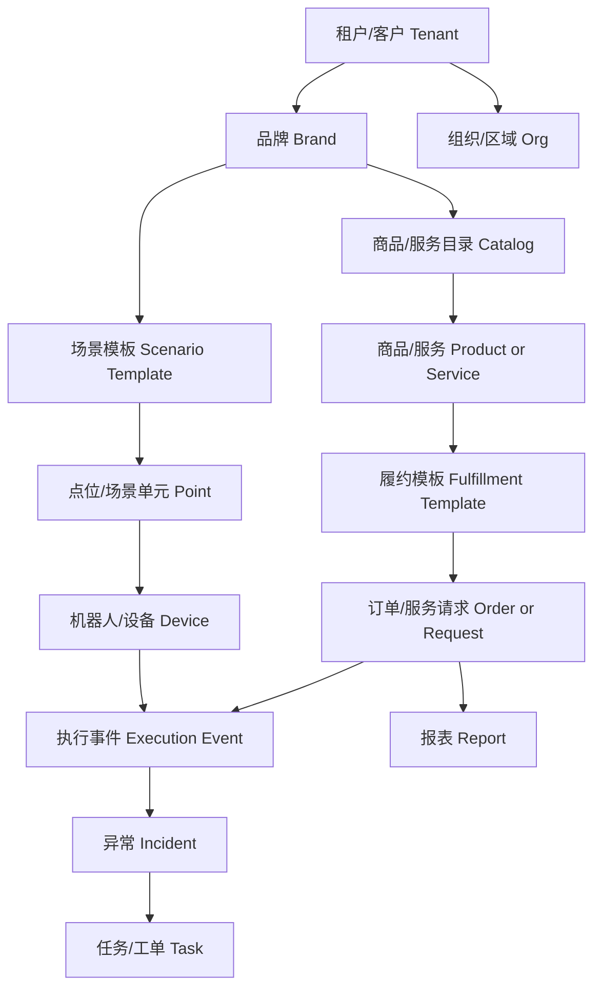

# RoboOps 系统规划与 MVP 框架

整理日期：2026-07-05
系统英文名：RoboOps
系统中文名：机器人商业运营平台

## 1. 本期 MVP 原则

本期 MVP 的目标是先搭出一套可以承载茶饮、咖啡、零售、服务站等多种机器人商业场景的运营系统骨架。

核心判断：

- RoboOps 定义为机器人商业运营平台，茶饮/咖啡亭是可配置场景模板。
- 饮品亭可以作为第一套场景模板，但不能成为系统底层硬编码。
- 品牌、点位、商品/服务、机器人/设备、履约流程、异常规则、权限角色都应尽量配置化。
- MVP 先做“可配置框架 + 一个可跑通的样板场景”，再逐步补齐垂直行业深度。
- 本期先做轻量状态机、规则配置和模板化对象，完整流程引擎放到后续阶段。

推荐的产品骨架是：

> 场景模板 + 品牌/租户配置 + 商品/服务目录 + 点位/设备绑定 + 履约状态机 + 异常规则 + 权限模板 + 运营看板

MVP 边界补充：

- 数据模型中保留租户、品牌、场景模板和数据范围，避免后续重构。
- 界面和交付上可以先支持少量客户、少量品牌、少量样板模板，不要求第一版达到完整 SaaS 多租户能力。
- 支付、退款、配置发布、设备命令、导出等高风险动作先做记录、权限和审批扩展位，不追求完整自动化闭环。
- 甲方缺少运营经验时，默认采用 RoboOps 推荐角色和异常分派模板，再按客户实际人员进行裁剪。

## 2. 外部调研归纳

本次补充调研参考了机器人运维平台、IoT 设备管理平台、商品目录平台和流程编排平台。它们对 RoboOps 的启发如下。

### 2.1 机器人运维平台

参考对象包括 Formant、InOrbit、Boston Dynamics Orbit 等机器人运营/机器人舰队管理产品。

共性能力：

- 机器人/设备舰队可视化。
- 多点位、多机器人状态监控。
- 任务、运行日志、性能指标、异常事件。
- 远程诊断、远程协助、事件响应。
- 从单台机器人扩展到多站点、多机器人协同。

对 RoboOps 的启发：

- 机器人状态和商业订单不能分开看。订单异常往往来自机器人、设备、物料、支付、人机交互或点位环境。
- 平台首页应该同时呈现经营状态和机器人运行状态。
- 异常中心比普通告警列表更重要，需要能分派、跟进、关闭、转退款或转工单。
- 多客户、多品牌、多点位会成为基础模型，不应后期再补。

### 2.2 IoT 设备管理平台

参考对象包括 AWS IoT Device Management 的 Thing Registry、Thing Groups、Fleet Indexing、Jobs 等能力。

共性能力：

- 设备注册和设备档案。
- 静态/动态设备分组。
- 按属性、连接状态、影子状态检索设备。
- 批量任务、远程命令、软件/固件下发。
- 设备日志、版本、运行指标、规则触发。

对 RoboOps 的启发：

- RoboOps 需要设备台账，但不能停留在设备台账。
- 点位、品牌、场景、设备类型、版本、能力标签都应该成为设备检索和下发范围。
- MVP 可以先做“配置发布记录”和“命令/事件日志”，暂不做完整 OTA 和复杂远程作业系统。
- 设备分组思想可用于运营范围，例如某品牌某城市的所有咖啡亭、某型号机器人、某版本软件设备。

### 2.3 商品目录与可配置商业对象

参考对象包括 commercetools 等可组合电商/商品目录模型。

共性能力：

- 用 Product Type 定义某类商品的字段和属性。
- Product 作为商品抽象，Variant/SKU 作为可售规格。
- 属性可以是枚举、文本、数字、多语言、图片、资产等。
- 商品、规格、价格、渠道、上下架、库存/可用性可分层管理。

对 RoboOps 的启发：

- “奶茶/咖啡/零售商品/机器人服务”都可以抽象为 Product/Service。
- 不同场景的字段不一样，所以需要“商品/服务类型 + 自定义属性”。
- 饮品的糖度、温度、杯型、配方是某个场景模板下的属性，不应写死到核心系统。
- 未来非饮品场景可以用同一套目录表达，例如售卖周边、递送服务、讲解服务、清洁服务、样品处理服务。

### 2.4 流程/状态机与流程引擎

参考对象包括 Camunda BPMN、Temporal durable workflow 等流程系统。

共性能力：

- 把业务流程拆成可观察、可恢复、可追踪的步骤。
- 支持人工任务、系统任务、超时、重试、补偿、异常分支。
- 长流程需要保留状态，不应只靠接口瞬时返回值。

对 RoboOps 的启发：

- 订单/服务请求应有明确生命周期，覆盖支付成功/失败之外的履约、交付、异常和退款节点。
- 机器人执行过程需要事件流和状态机，例如已下发、执行中、执行完成、待取走、未取走、异常。
- MVP 不建议直接上完整 BPMN/Temporal 级别流程引擎，先做配置化状态机更稳。
- 后续当场景数量变多、跨系统集成变复杂，再考虑引入工作流引擎。

### 2.5 TeaPilot 参考系统

TeaPilot 更像“智能茶饮设备统一管理后台”，参考价值是帮助 RoboOps 理解自动化商业设备后台的基础盘。

可参考部分：

- 点位/门店、设备、订单、商品、配方/流程、物料、清洗维护、报表、权限、日志、通知、版本管理。
- 订单从下单、支付、下发、制作、出料、完成、异常、退单到报表，是一条履约链路。
- 设备不只是在线/离线，还要能查看日志、重启、调试、下发模板、管理版本和维护记录。

不能直接套用部分：

- TeaPilot 的底层语义偏茶饮设备，RoboOps 需要抽象成机器人商业运营。
- RoboOps 要覆盖人形机器人特有问题，例如人机交互异常、顾客未取走、机器人感知误判、人工接管、多机器人协同。
- 重点是提炼“什么角色在什么场景处理什么状态和异常”。

## 3. 产品定位

RoboOps 的产品定位建议定义为：

> 面向机器人、自动化设备与具身智能商业落地场景的可配置运营平台。它把品牌、点位、机器人/设备、商品/服务、订单/服务请求、履约流程、异常处理、人员角色和经营数据组织成一套可复制的商业运营系统。

它的能力范围应覆盖：

- 多场景商业运营：茶饮、咖啡、服务站等通过场景模板承载。
- 设备、订单、异常、任务、配置、权限和报表的端到端运营闭环。
- 多客户可复用的标准产品，通过模板、字段、流程和权限配置承接差异。
- 给机器人公司补齐商业运营能力的平台。
- 给运营人员、客服、运维、老板使用的后台。
- 可以通过配置支持不同品牌、不同场景、不同机器人/设备组合的标准产品。

## 4. 核心抽象模型

RoboOps 的底层对象建议按以下方式抽象。

核心对象说明：

- 租户/客户：购买或使用 RoboOps 的主体，例如某机器人公司、某运营公司。
- 品牌：对外经营品牌，可以由租户配置多个品牌。
- 组织/区域：总部、城市、区域、门店组、运维组等管理结构。
- 场景模板：饮品亭、咖啡亭、无人零售站、机器人讲解站、机器人配送站等。
- 点位/场景单元：真实部署位置，不局限于门店。
- 机器人/设备：人形机器人、机械臂、咖啡机、制茶机、取货柜、屏幕、支付设备、传感器等。
- 商品/服务：可以被下单或被调度执行的商业对象。
- SKU/规格/选项：商品或服务的可售规格。
- 履约模板：从订单到完成的状态链路。
- 订单/服务请求：客户发起或系统生成的商业请求。
- 执行事件：机器人、设备、支付、订单系统上报的过程事件。
- 异常：需要人处理或系统自动恢复的业务问题。
- 任务/工单：异常、维护、补货、退款、人工确认等执行事项。
- 配置发布：品牌、点位、商品、流程、设备模板等配置的发布记录。
- 权限角色：不同角色可见、可操作的范围。

## 5. 可配置框架

### 5.1 品牌配置

品牌配置用于解决“同一套系统服务不同品牌”的问题。

建议字段：

- 品牌名称、Logo、主题色。
- 所属租户、启用状态。
- 默认经营场景。
- 默认支付/结算配置占位。
- 默认通知配置。
- 默认售后规则。
- 品牌级商品/服务目录。
- 品牌级报表口径。

MVP 重点：

- 先支持品牌档案、品牌状态、品牌与场景模板绑定。
- Logo、主题色可以先作为字段保留，不必一开始做完整前台换肤。

### 5.2 场景模板配置

场景模板用于解决“不要把茶饮写死”的问题。

建议字段：

- 模板名称，例如饮品亭、咖啡亭、机器人服务站。
- 业务对象命名，例如商品、饮品、服务、任务。
- 启用模块，例如商品、物料、配方、取货、服务时长、预约。
- 默认履约状态机。
- 默认异常字典。
- 默认角色模板。
- 默认报表指标。
- 默认设备能力要求。

MVP 重点：

- 至少内置 2 个样板模板：饮品亭、通用机器人服务站。
- 饮品亭可以有糖度、温度、杯型等字段。
- 通用机器人服务站可以有服务类型、服务时长、执行地点、预约时间等字段。

### 5.3 商品/服务目录配置

商品/服务目录用于承载不同商业对象。

建议字段：

- 类型：实物商品、饮品商品、机器人服务、租赁服务、预约服务。
- 名称、编码、图片、状态。
- 自定义属性组。
- SKU/规格/选项。
- 价格、渠道、上下架状态。
- 所属品牌、适用点位、适用场景。
- 绑定履约模板。

MVP 重点：

- 商品/服务类型 + 自定义属性。
- SKU/规格/选项。
- 上下架和适用点位。
- 暂不做复杂会员价、优惠券、套餐、库存锁定。

### 5.4 点位配置

点位是商业落地的最小运营单元。

建议字段：

- 点位名称、编码、地址、经纬度。
- 所属品牌、所属组织/区域。
- 场景模板。
- 营业时间、营业状态。
- 绑定机器人/设备。
- 可售商品/服务范围。
- 负责人、运维负责人、客服负责人。
- 点位配置版本。

MVP 重点：

- 点位列表、点位详情、绑定设备、启停状态。
- 支持按品牌、区域、场景、状态筛选。

### 5.5 机器人/设备配置

设备管理需要兼顾机器人和自动化商业设备。

建议字段：

- 设备 SN、名称、类型、型号、厂商。
- 所属点位、所属品牌。
- 在线状态、运行状态、最后心跳。
- 软件版本、固件版本、配置版本。
- 能力标签，例如制饮、递送、语音交互、视觉识别、取货检测。
- 支持命令，例如重启、暂停营业、恢复营业、同步配置。
- 事件映射，例如设备错误码到异常类型。

MVP 重点：

- 设备台账、状态、绑定点位。
- 设备事件日志。
- 预留远程命令记录，不做复杂远程控制。

### 5.6 履约状态机配置

履约状态机是 RoboOps 的核心。不同场景可以显示不同名称，但底层状态应该保持统一。

建议底层状态：

- `created`：已创建。
- `pending_payment`：待支付。
- `paid`：已支付。
- `ready_to_execute`：待执行。
- `assigned`：已分配。
- `executing`：执行中。
- `execution_completed`：执行完成。
- `awaiting_delivery`：待交付/待取走。
- `delivered`：已交付/已取走。
- `not_delivered`：未交付/未取走。
- `exception`：异常。
- `cancelled`：已取消。
- `refund_pending`：退款处理中。
- `refunded`：已退款。

场景显示示例：

- 饮品亭：待制作、制作中、出杯完成、待取杯、已取杯、未取杯。
- 咖啡亭：待冲煮、制作中、待取杯、已取杯。
- 机器人服务站：待派单、已派发、服务中、服务完成、待确认、已确认。

MVP 重点：

- 先做固定底层状态 + 可配置显示名。
- 支持状态流转记录。
- 支持超时触发异常。
- 暂不做可视化流程设计器。

### 5.7 异常规则配置

异常中心是本系统区别于普通设备后台的关键。

异常来源：

- 支付异常。
- 订单下发失败。
- 机器人执行失败。
- 设备故障。
- 物料不足。
- 制作/服务超时。
- 顾客未取走。
- 机器人感知不确定。
- 人机交互中断。
- 退款/售后异常。

建议字段：

- 异常类型。
- 来源系统。
- 触发条件。
- 严重等级。
- 所属订单/点位/设备。
- 默认处理角色。
- SOP 文案。
- 是否通知。
- 是否允许转退款、转工单、转人工确认。

MVP 重点：

- 异常列表、异常详情、处理状态、负责人、处理记录。
- 支持手动创建异常。
- 支持从订单/设备事件生成异常。

## 6. MVP 信息架构

建议第一版后台菜单如下。

### 6.1 工作台

- 今日订单/服务请求。
- 今日收入或交易额占位。
- 运行中点位。
- 在线/离线设备。
- 待处理异常。
- 待处理任务。
- 最近配置发布。

### 6.2 客户、品牌或组织

- 租户/客户管理。
- 品牌管理。
- 组织/区域管理。
- 人员归属。

### 6.3 场景模板

- 场景模板列表。
- 模板详情。
- 模板字段配置。
- 模板状态机配置。
- 模板异常字典。

### 6.4 点位管理

- 点位列表。
- 点位详情。
- 绑定机器人/设备。
- 点位营业状态。
- 点位可售商品/服务。

### 6.5 机器人/设备管理

- 设备列表。
- 设备详情。
- 设备运行状态。
- 设备事件日志。
- 设备配置版本。
- 命令记录。

### 6.6 商品/服务目录

- 商品/服务类型。
- 商品/服务列表。
- SKU/规格/选项。
- 上下架。
- 适用点位。

### 6.7 订单/服务请求中心

- 订单/服务请求列表。
- 订单详情。
- 支付状态。
- 履约状态。
- 执行事件。
- 退款/取消状态占位。

### 6.8 异常中心

- 异常列表。
- 异常详情。
- 异常分派。
- 处理记录。
- 转退款、转工单、关闭。

### 6.9 任务/工单

- 补货任务。
- 维护任务。
- 人工确认任务。
- 客服处理任务。

MVP 可以先做轻量任务，不做完整工单系统。

### 6.10 配置发布中心

- 商品配置发布。
- 点位配置发布。
- 设备模板发布。
- 场景模板发布。
- 发布范围、版本、发布时间、发布人。

MVP 可以先做记录和状态，不做复杂灰度发布。

### 6.11 报表

- 订单报表。
- 点位报表。
- 设备运行报表。
- 异常报表。
- 商品/服务报表。

MVP 先做基础统计和导出占位。

### 6.12 用户、角色与权限

- 用户管理。
- 角色模板与角色实例。
- 权限包。
- 数据范围。
- 基础审批策略。
- 异常默认负责人。
- 操作日志。

## 7. MVP 必做与暂不做

### 7.1 本期必做

- 租户边界、品牌、组织、角色的基础框架；MVP 可先支持少量客户/品牌，不要求完整 SaaS 商业化能力。
- 场景模板能力，至少包含饮品亭和通用机器人服务站两个样板。
- 点位管理和点位绑定机器人/设备。
- 机器人/设备台账、在线状态、事件日志。
- 商品/服务目录，支持自定义属性和 SKU/规格。
- 订单/服务请求列表、详情、生命周期状态。
- 轻量状态机，支持底层状态和场景显示名。
- 异常中心，支持异常生成、分派、处理、关闭。
- 配置发布记录，至少能记录谁在什么时候把什么配置发布到哪些点位。
- 工作台看板，呈现点位、设备、订单、异常、任务的关键数量。
- 操作日志和基础权限。

### 7.2 本期暂不做

- 完整配方引擎。
- 完整库存、仓储、采购、补货系统。
- 完整财务结算、分账、对账系统。
- 完整 OTA、远程控制、远程调试系统。
- 复杂 BPMN/Temporal 级工作流引擎。
- 会员、优惠券、营销系统。
- 高级 BI 和自定义报表设计器。
- 真正多机器人交通调度和空间编排。
- 完整客服工单系统。

这些能力可以保留扩展位，但不应挤占本期 MVP 的系统骨架目标。

## 8. 状态模型建议

### 8.1 订单/服务请求状态

底层状态统一，显示名按场景配置。

| 底层状态 | 默认中文 | 饮品亭显示示例 | 机器人服务站显示示例 |
| --- | --- | --- | --- |
| `created` | 已创建 | 已下单 | 已创建 |
| `pending_payment` | 待支付 | 待支付 | 待支付 |
| `paid` | 已支付 | 已支付 | 已支付 |
| `ready_to_execute` | 待执行 | 待制作 | 待派单 |
| `assigned` | 已分配 | 已下发设备 | 已派发机器人 |
| `executing` | 执行中 | 制作中 | 服务中 |
| `execution_completed` | 执行完成 | 出杯完成 | 服务完成 |
| `awaiting_delivery` | 待交付 | 待取杯 | 待确认 |
| `delivered` | 已交付 | 已取杯 | 已确认 |
| `not_delivered` | 未交付 | 未取杯 | 未确认 |
| `exception` | 异常 | 制作异常 | 服务异常 |
| `cancelled` | 已取消 | 已取消 | 已取消 |
| `refund_pending` | 退款处理中 | 退款处理中 | 退款处理中 |
| `refunded` | 已退款 | 已退款 | 已退款 |

### 8.2 异常状态

| 状态 | 含义 |
| --- | --- |
| `new` | 新异常，尚未分诊 |
| `triaged` | 已分诊，确认类型和等级 |
| `assigned` | 已分派负责人 |
| `processing` | 处理中 |
| `waiting_manual_confirm` | 等待人工确认 |
| `recovered` | 已恢复 |
| `closed` | 已关闭 |
| `converted_to_refund` | 已转退款 |
| `converted_to_field_service` | 已转现场处理 |

### 8.3 任务/工单状态

| 状态 | 含义 |
| --- | --- |
| `open` | 已创建 |
| `assigned` | 已分派 |
| `in_progress` | 处理中 |
| `waiting_external` | 等待外部条件 |
| `resolved` | 已解决 |
| `closed` | 已关闭 |
| `cancelled` | 已取消 |

## 9. 数据模型草案

第一版可按以下实体建模。

- `tenants`：租户/客户。
- `brands`：品牌。
- `organizations`：组织/区域。
- `users`：用户。
- `roles`：角色。
- `role_permissions`：角色权限。
- `role_templates`：角色模板。
- `permission_packages`：权限包。
- `data_scopes`：数据范围。
- `approval_policies`：审批策略。
- `incident_routing_rules`：异常分派规则。
- `scenario_templates`：场景模板。
- `scenario_fields`：场景自定义字段。
- `points`：点位/场景单元。
- `device_types`：设备类型。
- `devices`：机器人/设备。
- `device_capabilities`：设备能力标签。
- `device_events`：设备事件。
- `product_types`：商品/服务类型。
- `products`：商品/服务。
- `product_variants`：SKU/规格。
- `product_attributes`：商品/服务自定义属性。
- `fulfillment_templates`：履约模板。
- `lifecycle_states`：生命周期状态配置。
- `orders` 或 `service_requests`：订单/服务请求。
- `execution_events`：订单执行事件。
- `incidents`：异常。
- `tasks`：任务/工单。
- `config_releases`：配置发布记录。
- `audit_logs`：操作日志。
- `report_snapshots`：报表快照。

命名建议：

- 如果第一版以交易为主，可以先用 `orders`。
- 如果想从一开始更通用，可以命名为 `service_requests`，再把饮品订单作为一种请求类型。
- 折中做法：底层叫 `requests` 或 `business_requests`，界面按场景显示为订单、服务单、任务单。

## 10. 规划路线

### v0.1 产品骨架

目标：把核心对象和页面框架搭出来。

- 工作台。
- 品牌、组织、角色。
- 场景模板。
- 点位。
- 设备。
- 商品/服务目录。
- 订单/服务请求。
- 异常中心。

### v0.2 配置模型跑通

目标：证明核心模型保持通用，场景语义由配置承载。

- 配置一个饮品亭模板。
- 配置一个通用机器人服务站模板。
- 两个模板共用同一套底层对象。
- 商品/服务字段和状态显示名不同。

### v0.3 样板场景试点

目标：用一个真实业务场景跑起来。

- 以饮品亭或咖啡亭作为样板。
- 接入真实或模拟订单事件。
- 接入真实或模拟机器人/设备事件。
- 跑通订单生命周期和异常闭环。

### v0.4 运营闭环增强

目标：让几十个点位可以被运营。

- 异常规则更细。
- 任务/工单更完整。
- 报表更可用。
- 配置发布更清晰。
- 角色权限和数据范围更贴近组织。

## 11. MVP 验收标准

本期 MVP 可以按以下标准验收：

- 不改代码即可创建一个品牌。
- 不改代码即可选择或创建一个场景模板。
- 可以创建点位，并绑定机器人/设备。
- 可以为不同场景配置不同商品/服务字段。
- 可以配置商品/服务 SKU、上下架和适用点位。
- 可以创建或接入一笔订单/服务请求。
- 可以看到从创建、支付、执行、完成、待交付、已交付到异常/退款的状态链路。
- 可以从设备事件或超时规则生成异常。
- 可以把异常分派给客服、运维或运营角色，并记录处理过程。
- 工作台能看到点位、设备、订单/请求、异常、任务的基本数量。
- 茶、咖啡、服务站等显示语义来自场景配置，不出现在核心模型硬编码中。

## 12. 关键产品原则

- 核心模型通用，场景语义配置化。
- 状态机优先，完整流程引擎后置。
- 异常中心优先于高级 BI。
- 数据可追溯优先于自动化炫技。
- 先服务几十个点位跑起来，再服务复杂集团化运营。
- 先让机器人公司能运营，再谈更深的行业解决方案。
- 饮品亭是第一批样板，产品边界覆盖更多机器人商业场景。

## 13. 后续需要验证的事实与配置选择

以下问题用于验证事实、选择配置和控制实施范围，由 RoboOps 先给默认方案，再结合客户事实校准。

- 第一批真实参与方是机器人公司、品牌方、运营商，还是三者混合；这会影响默认组织模板。
- 系统第一版是内部/平台代运营使用，还是直接给客户自助使用；这会影响账号、权限和审计要求。
- 第一批点位规模是 5 个、20 个、50 个还是 100 个；这会影响看板、筛选、任务分派和数据范围粒度。
- 当前已有设备 API 可以提供哪些事件：心跳、在线、错误码、订单执行步骤、取货检测、日志、重启结果。
- 支付和退款由 RoboOps 直接承接，还是先对接外部订单/支付系统；MVP 至少保留状态、记录和权限。
- MVP 是否开放多品牌配置界面；无论界面是否开放，模型应保留品牌维度。
- 是否需要白标能力；MVP 可先保留品牌信息和主题字段，不急于做完整白标。
- 展会/样板间演示是否需要一套可配置 Demo 数据。

## 14. 调研来源

- [Formant Fleet Observability](https://docs.formant.io/docs/fleet-observability)
- [Formant Incident Management](https://docs.formant.io/docs/incident-management)
- [InOrbit Robot Operations Platform](https://www.inorbit.ai/)
- [InOrbit Robot Orchestration](https://www.inorbit.ai/multi-vehicle-orchestration)
- [Boston Dynamics Orbit](https://bostondynamics.com/products/orbit/)
- [AWS IoT Fleet Indexing](https://docs.aws.amazon.com/iot/latest/developerguide/iot-indexing.html)
- [AWS IoT Jobs](https://docs.aws.amazon.com/iot/latest/developerguide/iot-jobs.html)
- [AWS IoT Dynamic Thing Groups](https://docs.aws.amazon.com/iot/latest/developerguide/dynamic-thing-groups.html)
- [commercetools Product Catalog Overview](https://docs.commercetools.com/api/product-catalog-overview)
- [commercetools Product Modeling](https://docs.commercetools.com/learning-model-your-product-catalog/product-modeling/modeling-products)
- [Camunda BPMN Reference](https://camunda.com/en/bpmn/reference/)
- [Camunda BPMN in Modeler](https://docs.camunda.io/docs/components/modeler/bpmn/)
- [Temporal Documentation](https://docs.temporal.io/)
- [Temporal Workflow Execution](https://docs.temporal.io/workflow-execution)

## 15. 下一步建议

建议接下来继续产出 4 份材料：

1. `07-PRD-v0.1.md`：把系统规划和角色权限模型转成产品需求文档。
2. `08-信息架构与页面清单.md`：定义后台菜单、页面和关键字段。
3. `09-核心数据模型ERD.md`：把实体关系画清楚，方便后端开始建模。
4. `10-MVP原型与演示数据方案.md`：定义第一版 Demo 数据、样板场景和演示流程。
