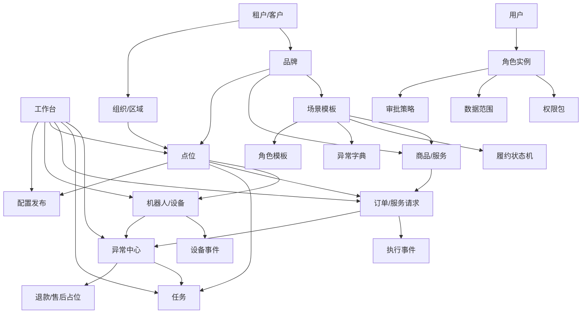

# RoboOps 信息架构与页面清单

整理日期：2026-07-05
系统英文名：RoboOps
系统中文名：机器人商业运营平台

## 1. 文档目标

本文档定义 RoboOps MVP 后台的信息架构、菜单结构、页面清单、关键字段、主要操作和页面间跳转关系。

本期后台是面向机器人、自动化设备与具身智能商业落地场景的可配置运营平台。MVP 页面设计应服务以下目标：

- 跑通“品牌或组织 - 场景模板 - 点位 - 机器人/设备 - 商品/服务 - 订单/服务请求 - 异常 - 任务 - 配置发布 - 报表 - 权限”的最小闭环。
- 支持饮品亭作为第一批样板场景，但核心菜单和字段不硬编码茶饮语义。
- 让缺少商业运营经验的客户能按默认模板搭团队、分权限、处理异常。
- 把高风险动作纳入权限、审批、二次确认和操作日志。
- 为后续多品牌、多场景、多点位、多设备、多角色扩展保留数据范围和配置发布能力。

## 2. 信息架构原则

### 2.1 核心对象通用，场景语义配置化

核心对象使用通用名称：

- 点位/场景单元，门店作为场景模板中的显示名。
- 商品/服务，饮品或配方作为场景模板中的属性。
- 订单/服务请求，兼容购买型和服务型履约。
- 异常/事件，覆盖设备告警、履约异常和人工确认。
- 任务/工单，先支撑异常闭环和现场处理。

饮品亭、咖啡亭、机器人服务站等差异，优先通过场景模板字段、状态显示名、异常字典和商品/服务类型表达。

### 2.2 经营视角和设备视角必须打通

后台首页和详情页不能只看经营数据，也不能只看设备状态。典型跳转应支持：

- 从订单查看关联点位、设备、执行事件和异常。
- 从设备查看当前点位、最近订单、设备事件和关联异常。
- 从异常查看来源订单、来源设备、负责人、处理任务和退款状态。
- 从点位查看营业状态、设备、商品/服务、订单、异常、任务和配置版本。

### 2.3 配置编辑和配置发布分离

商品/服务、场景模板、点位可售范围、设备模板等配置可以被编辑，但真正影响点位经营或设备运行时，应通过配置发布中心记录版本、范围、发布人、发布时间和状态。

MVP 可以先做发布记录和状态，不做复杂灰度、回滚和多级审批，但页面结构需要预留。

### 2.4 权限不只是菜单可见性

权限需要同时控制：

- 能看哪些菜单。
- 能执行哪些动作。
- 能访问哪些品牌、区域、点位、设备和商品/服务。
- 是否能发起或审批高风险动作。
- 是否能导出数据。
- 是否是异常或任务的默认负责人。

## 3. MVP 后台一级菜单

| 序号 | 一级菜单 | 定位 | MVP 页面 |
| --- | --- | --- | --- |
| 1 | 工作台 | 实时运营总览和待办入口 | 运营首页、待处理异常、待处理任务、最近发布 |
| 2 | 品牌或组织 | 租户、品牌、组织、人员归属 | 租户管理、品牌管理、组织/区域、团队搭建向导 |
| 3 | 场景模板 | 定义不同机器人商业场景的配置骨架 | 模板列表、模板详情、字段配置、状态机、异常字典 |
| 4 | 点位 | 管理真实部署位置和经营单元 | 点位列表、点位详情、营业状态、绑定设备、可售范围 |
| 5 | 机器人/设备 | 管理机器人和自动化商业设备 | 设备列表、设备详情、事件日志、命令记录、版本信息 |
| 6 | 商品/服务 | 管理可售或可执行的商业对象 | 类型管理、商品/服务列表、详情、SKU/规格、适用点位 |
| 7 | 订单/服务请求 | 查看交易和履约生命周期 | 请求列表、请求详情、支付状态、履约状态、执行事件 |
| 8 | 异常中心 | 分诊、分派、处理和关闭异常 | 异常列表、异常详情、分派处理、转退款、转任务 |
| 9 | 任务 | 承接异常、维护、补给和人工确认 | 任务列表、任务详情、任务分派、处理记录 |
| 10 | 配置发布 | 记录配置从草稿到点位/设备的发布 | 发布列表、发布详情、发布创建、发布结果 |
| 11 | 报表 | 基础经营、点位、设备和异常分析 | 经营报表、点位报表、设备报表、异常报表、商品/服务报表 |
| 12 | 用户角色权限 | 搭团队、授权、审批、审计 | 用户管理、角色模板、角色实例、权限包、数据范围、审批策略、操作日志 |

## 4. 页面关系总览



## 5. 工作台

### 5.1 运营首页

用途：让运营负责人、值班人员、业务负责人快速判断今天是否正常经营。

关键模块：

| 模块 | 关键字段 | 说明 |
| --- | --- | --- |
| 今日概览 | 今日订单/服务请求数、交易额占位、完成数、异常数、退款处理中数 | 金额可先为占位或外部支付汇总 |
| 点位状态 | 运行中点位、停业点位、异常点位、待上线点位 | 可按品牌、区域、场景筛选 |
| 设备状态 | 在线设备、离线设备、故障设备、最近心跳异常 | 设备状态需要能下钻 |
| 待处理异常 | 新异常、超 SLA 异常、高等级异常、待人工确认 | 默认按等级和时间排序 |
| 待处理任务 | 待分派、处理中、等待外部、即将超时 | 任务来自异常、维护、补给、人工确认 |
| 最近配置发布 | 发布时间、发布对象、范围、状态、发布人 | 用于快速发现配置变更影响 |

主要操作：

- 切换品牌、区域、场景、时间范围。
- 点击指标下钻到对应列表。
- 对待处理异常执行分派、认领、查看详情。
- 对待处理任务执行认领、分派、查看详情。
- 查看最近发布详情。

页面跳转：

- 今日订单/服务请求数 -> 订单/服务请求列表，带今日筛选。
- 异常数 -> 异常中心，带未关闭筛选。
- 离线设备 -> 设备列表，带离线筛选。
- 异常点位 -> 点位列表，带异常点位筛选。
- 待处理任务 -> 任务列表，带当前用户或未分派筛选。
- 最近配置发布 -> 配置发布详情。

### 5.2 我的待办

用途：给客服、设备运维、现场维护、配置审批人等角色聚合个人职责。

关键字段：

- 待办类型：异常、任务、退款审批、配置审批、人工确认。
- 关联对象：订单/服务请求、点位、设备、配置发布。
- 优先级、SLA 截止时间、当前状态、来源。
- 创建时间、负责人、协作者。

主要操作：

- 认领、转派、开始处理、添加处理记录。
- 跳转关联对象详情。
- 完成任务或提交审批结果。

页面跳转：

- 异常待办 -> 异常详情。
- 任务待办 -> 任务详情。
- 配置审批待办 -> 配置发布详情。
- 退款审批待办 -> 订单/服务请求详情的退款区块。

## 6. 品牌或组织

### 6.1 租户/客户管理

用途：管理使用 RoboOps 的客户主体。MVP 可先仅平台支持或超级管理员可见。

关键字段：

- 租户名称、租户编码、联系人、联系电话、启用状态。
- 经营模式：自营、平台代运营、联合运营、加盟/区域代理。
- 默认数据隔离范围、开通模块、创建时间。
- 备注、平台支持负责人。

主要操作：

- 创建租户、编辑租户档案、启用/停用。
- 查看租户下品牌、组织、用户、点位。
- 初始化推荐团队模板。

页面跳转：

- 租户详情 -> 品牌列表，带租户筛选。
- 租户详情 -> 用户管理，带租户筛选。
- 租户详情 -> 团队搭建向导。

### 6.2 品牌管理

用途：管理对外经营品牌及其默认配置。

关键字段：

- 品牌名称、品牌编码、所属租户、Logo、主题色、启用状态。
- 默认场景模板、默认售后规则、默认通知规则。
- 支付/结算配置占位、品牌级报表口径。
- 品牌负责人、运营负责人、创建时间、更新时间。

主要操作：

- 创建品牌、编辑品牌资料。
- 绑定默认场景模板。
- 设置品牌负责人和运营负责人。
- 查看品牌下点位、商品/服务、订单、异常、报表。

页面跳转：

- 品牌详情 -> 点位列表，带品牌筛选。
- 品牌详情 -> 商品/服务列表，带品牌筛选。
- 品牌详情 -> 场景模板详情。
- 品牌详情 -> 报表，带品牌筛选。
- 品牌详情 -> 用户角色权限，查看品牌范围内授权。

### 6.3 组织/区域管理

用途：管理总部、城市、区域、点位组、运维组等运营层级。

关键字段：

- 组织名称、组织类型、上级组织、所属租户、所属品牌。
- 城市/区域、负责人、联系电话、启用状态。
- 关联点位数、关联用户数、数据范围规则。

主要操作：

- 创建组织、调整组织层级、设置负责人。
- 将点位归入组织/区域。
- 将用户授权到组织/区域数据范围。

页面跳转：

- 组织详情 -> 点位列表，带组织筛选。
- 组织详情 -> 用户管理，带组织筛选。
- 组织详情 -> 报表，带区域筛选。

### 6.4 团队搭建向导

用途：帮助没有成熟运营团队的客户生成推荐角色、权限、负责人和异常分派规则。

关键字段：

- 经营模式、点位规模、是否多品牌、是否跨城市。
- 是否自有客服、是否自有设备运维、是否自有现场服务。
- 是否处理支付/退款、是否夜间值守、是否有外部点位方登录。
- 推荐团队模板、推荐角色清单、待邀请人员清单。

主要操作：

- 选择经营模式和规模。
- 生成推荐角色模板。
- 批量创建角色实例。
- 生成异常默认负责人规则。
- 生成基础审批策略。

页面跳转：

- 向导完成 -> 角色实例列表。
- 向导完成 -> 异常分派规则。
- 向导完成 -> 审批策略。
- 待邀请人员 -> 用户邀请页。

## 7. 场景模板

### 7.1 场景模板列表

用途：管理饮品亭、咖啡亭、通用机器人服务站等可复用场景骨架。

关键字段：

- 模板名称、模板编码、模板类型、启用状态。
- 业务对象显示名：商品、服务、订单、服务请求等。
- 关联品牌数、关联点位数、最后更新时间。
- 内置/自定义标记、创建人、版本号。

主要操作：

- 新建模板、复制模板、启用/停用。
- 从内置模板创建客户模板。
- 查看模板详情和配置完整度。

页面跳转：

- 模板名称 -> 场景模板详情。
- 关联点位数 -> 点位列表，带场景模板筛选。
- 关联品牌数 -> 品牌列表，带模板筛选。

### 7.2 场景模板详情

用途：汇总某个场景模板的业务字段、状态机、异常字典、默认角色和报表指标。

关键字段：

- 基础信息：名称、编码、说明、适用场景、启用模块。
- 默认履约状态机、默认异常字典、默认角色模板。
- 默认设备能力要求、默认报表指标。
- 当前版本、最近发布版本、发布状态。

主要操作：

- 编辑基础信息。
- 配置字段、状态机、异常字典。
- 配置默认设备能力要求。
- 发起场景模板配置发布。

页面跳转：

- 字段配置 -> 模板字段配置页。
- 状态机 -> 履约状态机配置页。
- 异常字典 -> 异常字典配置页。
- 角色模板 -> 用户角色权限的角色模板详情。
- 发起发布 -> 配置发布创建页。

### 7.3 模板字段配置

用途：定义不同场景下商品/服务、点位、订单/服务请求需要的自定义字段。

关键字段：

- 字段名称、字段编码、字段归属对象。
- 字段类型：文本、数字、枚举、布尔、图片、时间、地址。
- 是否必填、默认值、校验规则、显示顺序。
- 是否用于筛选、是否用于报表、是否启用。

主要操作：

- 新增字段、编辑字段、停用字段。
- 调整排序。
- 配置枚举值。
- 查看字段被哪些商品/服务或点位使用。

页面跳转：

- 字段使用情况 -> 商品/服务列表或点位列表。
- 保存后 -> 场景模板详情。
- 发布字段变更 -> 配置发布创建页。

### 7.4 履约状态机配置

用途：将统一底层状态映射为场景显示名，并配置超时触发异常。

关键字段：

- 底层状态：created、pending_payment、paid、ready_to_execute、assigned、executing、execution_completed、awaiting_delivery、delivered、not_delivered、exception、cancelled、refund_pending、refunded。
- 场景显示名、状态说明、是否前台可见、是否终态。
- 允许流转目标、超时时长、超时异常类型。

主要操作：

- 修改显示名。
- 配置允许流转和超时规则。
- 预览订单/服务请求生命周期。
- 发起发布。

页面跳转：

- 超时异常类型 -> 异常字典配置页。
- 发布 -> 配置发布创建页。
- 预览 -> 示例订单/服务请求状态链路。

### 7.5 异常字典配置

用途：定义场景下可能出现的异常类型、等级、默认负责人和处理 SOP。

关键字段：

- 异常类型、异常编码、来源系统、触发条件。
- 严重等级、默认负责人角色、升级负责人角色。
- SLA、SOP 文案、通知规则。
- 是否允许转退款、转现场任务、转人工确认、自动关闭。

主要操作：

- 新增异常类型、编辑异常规则、停用异常类型。
- 设置默认负责人和升级路径。
- 绑定处理 SOP。
- 发起发布。

页面跳转：

- 默认负责人角色 -> 角色模板或角色实例详情。
- 关联任务类型 -> 任务类型配置占位。
- 发布 -> 配置发布创建页。

## 8. 点位

### 8.1 点位列表

用途：管理真实部署位置和最小经营单元。

关键字段：

- 点位名称、点位编码、所属品牌、所属组织/区域、城市。
- 场景模板、营业状态、运行状态、上线状态。
- 地址、经纬度、负责人、运维负责人、客服负责人。
- 绑定设备数、今日订单/服务请求数、未关闭异常数、当前配置版本。

主要操作：

- 新建点位、编辑点位、批量设置负责人。
- 设置营业状态：营业、暂停营业、维护中、待上线、停用。
- 绑定或解绑机器人/设备。
- 配置可售商品/服务范围。
- 发起点位配置发布。

页面跳转：

- 点位名称 -> 点位详情。
- 所属品牌 -> 品牌详情。
- 场景模板 -> 场景模板详情。
- 绑定设备数 -> 设备列表，带点位筛选。
- 未关闭异常数 -> 异常中心，带点位筛选。
- 当前配置版本 -> 配置发布详情。

### 8.2 点位详情

用途：查看和管理单个点位的经营、设备、商品/服务和异常任务。

建议页签：

| 页签 | 关键字段 | 主要操作 |
| --- | --- | --- |
| 概览 | 营业状态、运行状态、今日订单、今日异常、在线设备、负责人 | 设置营业状态、查看报表 |
| 基础信息 | 名称、编码、地址、经纬度、品牌、组织、场景模板 | 编辑基础信息 |
| 设备 | 设备 SN、类型、状态、版本、最后心跳 | 绑定设备、解绑设备、查看设备详情 |
| 商品/服务 | 可售商品/服务、价格、上下架状态、适用时间 | 调整可售范围、查看商品详情 |
| 订单/请求 | 最近订单/服务请求、状态、金额占位、异常标记 | 查看请求详情 |
| 异常 | 未关闭异常、等级、负责人、SLA | 分派、查看异常详情 |
| 任务 | 补给、维护、巡检、人工确认 | 创建任务、分派任务 |
| 配置版本 | 当前点位版本、最近发布、发布人、发布时间 | 查看发布详情、发起发布 |

页面跳转：

- 设备页签 -> 设备详情。
- 商品/服务页签 -> 商品/服务详情。
- 订单/请求页签 -> 订单/服务请求详情。
- 异常页签 -> 异常详情。
- 任务页签 -> 任务详情。
- 配置版本 -> 配置发布详情。

## 9. 机器人/设备

### 9.1 设备列表

用途：管理机器人、机械臂、制饮设备、取货柜、屏幕、支付设备、传感器等设备台账。

关键字段：

- 设备 SN、设备名称、设备类型、型号、厂商。
- 所属品牌、所属点位、所属设备组。
- 在线状态、运行状态、最后心跳。
- 软件版本、固件版本、配置版本。
- 能力标签、未关闭异常数、最近事件时间。

主要操作：

- 新建设备、编辑设备档案。
- 绑定/解绑点位。
- 批量设置设备组或能力标签。
- 查看事件日志。
- 记录远程命令：重启、暂停营业、恢复营业、同步配置等。

页面跳转：

- 设备 SN -> 设备详情。
- 所属点位 -> 点位详情。
- 未关闭异常数 -> 异常中心，带设备筛选。
- 配置版本 -> 配置发布详情。

### 9.2 设备详情

用途：查看单台设备状态、版本、事件、命令和关联业务。

建议页签：

| 页签 | 关键字段 | 主要操作 |
| --- | --- | --- |
| 概览 | 在线状态、运行状态、最后心跳、当前点位、当前订单/请求 | 查看实时状态、刷新状态 |
| 基础信息 | SN、名称、类型、型号、厂商、能力标签 | 编辑设备档案 |
| 事件日志 | 事件时间、事件类型、错误码、原始消息、关联订单 | 查看事件、生成异常 |
| 命令记录 | 命令类型、发起人、结果、执行时间、风险等级 | 查看结果、重试占位 |
| 版本配置 | 软件版本、固件版本、配置版本、最近发布 | 同步配置占位、查看发布 |
| 异常任务 | 关联异常、维护任务、现场任务 | 分派、查看详情 |

主要操作：

- 绑定/解绑点位。
- 添加能力标签。
- 查看或下载日志占位。
- 发起低风险命令记录。
- 高风险命令二次确认并留痕。

页面跳转：

- 当前点位 -> 点位详情。
- 关联订单 -> 订单/服务请求详情。
- 事件生成异常 -> 异常详情。
- 维护任务 -> 任务详情。
- 最近发布 -> 配置发布详情。

### 9.3 设备事件日志

用途：按设备、点位、品牌、事件类型检索设备上报事件。

关键字段：

- 事件 ID、事件时间、设备 SN、点位、事件类型、错误码。
- 严重等级、原始消息、是否已生成异常、关联订单/服务请求。

主要操作：

- 筛选事件、查看原始消息。
- 手动生成异常。
- 关联已有异常。

页面跳转：

- 设备 SN -> 设备详情。
- 点位 -> 点位详情。
- 关联订单/服务请求 -> 请求详情。
- 已生成异常 -> 异常详情。

## 10. 商品/服务

### 10.1 商品/服务类型

用途：定义实物商品、饮品商品、机器人服务、租赁服务、预约服务等类型及字段。

关键字段：

- 类型名称、类型编码、所属场景模板、启用状态。
- 默认属性组、默认履约模板、默认上下架规则。
- 适用品牌、创建人、更新时间。

主要操作：

- 新建类型、复制类型、编辑字段。
- 绑定履约模板。
- 停用类型。

页面跳转：

- 类型详情 -> 模板字段配置。
- 关联商品数 -> 商品/服务列表，带类型筛选。
- 默认履约模板 -> 履约状态机配置。

### 10.2 商品/服务列表

用途：管理品牌下可售商品或可执行服务。

关键字段：

- 名称、编码、类型、所属品牌、所属场景模板。
- 图片、状态、价格区间、SKU 数、适用点位数。
- 上下架状态、最近发布版本、更新时间。

主要操作：

- 新建商品/服务、编辑基础信息。
- 上架/下架。
- 复制商品/服务。
- 批量设置适用点位。
- 发起商品/服务配置发布。

页面跳转：

- 名称 -> 商品/服务详情。
- 所属品牌 -> 品牌详情。
- 类型 -> 商品/服务类型。
- 适用点位数 -> 点位列表，带商品/服务筛选。
- 最近发布版本 -> 配置发布详情。

### 10.3 商品/服务详情

用途：配置某个商品或服务的属性、SKU、价格、履约模板和适用范围。

建议页签：

| 页签 | 关键字段 | 主要操作 |
| --- | --- | --- |
| 基础信息 | 名称、编码、类型、图片、说明、状态 | 编辑基础信息 |
| 属性 | 自定义字段、枚举值、图片、服务时长、预约要求 | 编辑属性 |
| SKU/规格 | SKU 编码、规格名、价格、状态、选项组合 | 新增 SKU、停用 SKU |
| 适用范围 | 适用品牌、点位、渠道、营业时间 | 设置适用点位 |
| 履约 | 绑定履约模板、状态显示名、超时规则 | 查看模板 |
| 发布记录 | 发布版本、发布范围、发布状态、发布人 | 查看发布详情 |

页面跳转：

- 类型字段 -> 模板字段配置。
- 适用点位 -> 点位详情或点位列表。
- 履约模板 -> 履约状态机配置。
- 发布记录 -> 配置发布详情。

## 11. 订单/服务请求

### 11.1 订单/服务请求列表

用途：查看客户发起或系统生成的商业请求及其生命周期。

关键字段：

- 请求编号、显示类型、所属品牌、点位、场景模板。
- 商品/服务、SKU/规格、数量、金额占位。
- 支付状态、履约状态、退款状态。
- 关联设备、创建时间、完成时间、异常标记。
- 顾客标识占位、来源渠道。

主要操作：

- 按品牌、点位、场景、状态、时间筛选。
- 查看详情。
- 手动创建异常。
- 添加备注。
- 人工确认状态占位。
- 发起退款占位。

页面跳转：

- 请求编号 -> 订单/服务请求详情。
- 点位 -> 点位详情。
- 商品/服务 -> 商品/服务详情。
- 关联设备 -> 设备详情。
- 异常标记 -> 异常详情或异常列表。

### 11.2 订单/服务请求详情

用途：完整呈现一笔请求从创建、支付、执行、交付、异常、退款的链路。

建议页签：

| 页签 | 关键字段 | 主要操作 |
| --- | --- | --- |
| 概览 | 请求编号、当前状态、品牌、点位、商品/服务、金额占位 | 添加备注、手动创建异常 |
| 生命周期 | 状态、显示名、流转时间、触发来源、操作人 | 查看状态历史 |
| 支付/退款 | 支付状态、支付时间、退款状态、退款原因、审批状态 | 发起退款、查看审批 |
| 执行事件 | 设备事件、机器人执行步骤、错误码、耗时 | 生成异常、查看设备 |
| 异常 | 关联异常、等级、负责人、处理状态 | 查看异常、转派 |
| 顾客/售后占位 | 顾客标识、联系方式占位、沟通记录占位 | 添加沟通备注 |
| 操作日志 | 操作人、动作、时间、前后值 | 查看审计记录 |

主要操作：

- 手动创建异常。
- 发起退款或取消占位。
- 添加客服备注。
- 人工确认交付/未交付。
- 查看关联设备事件。

页面跳转：

- 点位 -> 点位详情。
- 商品/服务 -> 商品/服务详情。
- 关联设备 -> 设备详情。
- 执行事件 -> 设备事件日志。
- 关联异常 -> 异常详情。
- 退款审批 -> 我的待办或审批策略详情。

## 12. 异常中心

### 12.1 异常列表

用途：集中处理支付、订单、机器人、设备、物料、超时、未取走、交互中断等异常。

关键字段：

- 异常编号、异常类型、来源系统、严重等级。
- 当前状态：new、triaged、assigned、processing、waiting_manual_confirm、recovered、closed、converted_to_refund、converted_to_field_service。
- 所属品牌、点位、设备、订单/服务请求。
- 默认负责人、当前负责人、SLA、创建时间、最后处理时间。
- 是否可转退款、是否可转现场任务。

主要操作：

- 分诊、认领、分派、转派。
- 添加处理记录。
- 转退款、转现场任务、转人工确认。
- 标记已恢复、关闭异常。
- 手动创建异常。

页面跳转：

- 异常编号 -> 异常详情。
- 订单/服务请求 -> 请求详情。
- 点位 -> 点位详情。
- 设备 -> 设备详情。
- 当前负责人 -> 用户详情。
- 转现场任务 -> 任务详情。

### 12.2 异常详情

用途：呈现异常上下文、处理 SOP、流转记录和可执行动作。

建议页签：

| 页签 | 关键字段 | 主要操作 |
| --- | --- | --- |
| 概览 | 类型、等级、状态、负责人、SLA、来源 | 认领、分派、升级 |
| 上下文 | 订单/请求、点位、设备、事件、顾客占位 | 跳转关联对象 |
| 处理 SOP | 默认处理角色、步骤说明、注意事项 | 标记步骤完成 |
| 处理记录 | 记录人、处理动作、说明、附件占位 | 添加记录 |
| 转化记录 | 转退款、转任务、转人工确认、关闭原因 | 查看转化对象 |
| 操作日志 | 操作人、动作、时间、前后值 | 查看审计 |

主要操作：

- 分派负责人。
- 调整等级。
- 添加处理记录。
- 转退款、转任务、转人工确认。
- 关闭异常并填写原因。

页面跳转：

- 来源事件 -> 设备事件日志或订单执行事件。
- 转退款 -> 订单/服务请求详情的退款区块。
- 转任务 -> 任务详情。
- 默认负责人角色 -> 角色实例详情。

## 13. 任务

### 13.1 任务列表

用途：轻量承接异常处理、补给、维护、巡检、人工确认和客服处理。MVP 不做完整 ITSM 或客服工单。

关键字段：

- 任务编号、任务类型、来源、标题。
- 状态：open、assigned、in_progress、waiting_external、resolved、closed、cancelled。
- 优先级、所属品牌、点位、设备、关联异常、关联订单/服务请求。
- 负责人、协作者、SLA、创建时间、完成时间。

主要操作：

- 新建任务、认领、分派、转派。
- 开始处理、添加处理记录、标记解决、关闭。
- 关联异常、点位、设备或订单/服务请求。

页面跳转：

- 任务编号 -> 任务详情。
- 关联异常 -> 异常详情。
- 点位 -> 点位详情。
- 设备 -> 设备详情。
- 订单/服务请求 -> 请求详情。

### 13.2 任务详情

用途：让负责人完成现场或后台处理，并留下结果。

关键字段：

- 任务标题、类型、状态、优先级、负责人、SLA。
- 来源：手动创建、异常转任务、系统规则生成。
- 关联对象：品牌、点位、设备、订单/服务请求、异常。
- 处理记录、附件占位、完成结果、关闭原因。

主要操作：

- 接受任务、转派、开始处理。
- 添加文字记录和图片/附件占位。
- 标记已解决、关闭任务。
- 创建后续任务。

页面跳转：

- 来源异常 -> 异常详情。
- 关联点位 -> 点位详情。
- 关联设备 -> 设备详情。
- 关联订单/服务请求 -> 请求详情。

## 14. 配置发布

### 14.1 配置发布列表

用途：记录商品/服务、点位、设备模板、场景模板等配置发布过程。

关键字段：

- 发布编号、发布类型、发布对象、发布范围。
- 版本号、状态：草稿、待审批、发布中、已发布、部分失败、失败、已回滚占位。
- 影响品牌、影响点位数、影响设备数。
- 发布人、审批人、发布时间、完成时间。

主要操作：

- 创建发布、提交审批、取消发布。
- 查看差异占位。
- 查看发布结果。
- 回滚申请占位。

页面跳转：

- 发布编号 -> 发布详情。
- 发布对象 -> 场景模板、商品/服务、点位或设备详情。
- 影响点位数 -> 点位列表，带发布范围筛选。
- 影响设备数 -> 设备列表，带发布范围筛选。

### 14.2 配置发布创建

用途：从配置编辑页面发起发布，确认发布对象、范围和风险。

关键字段：

- 发布类型：场景模板、商品/服务、点位、设备模板。
- 发布对象、版本号、变更说明。
- 发布范围：品牌、区域、点位、设备组、单台设备。
- 风险等级、是否需要审批、计划发布时间。

主要操作：

- 选择发布范围。
- 预览影响对象。
- 填写变更说明。
- 提交审批或直接发布。

页面跳转：

- 发布对象 -> 对应配置详情。
- 选择范围 -> 点位列表或设备列表。
- 提交后 -> 配置发布详情。
- 需要审批 -> 我的待办。

### 14.3 配置发布详情

用途：查看一次发布的完整记录和影响范围。

关键字段：

- 发布编号、类型、对象、版本、状态。
- 发布范围、影响对象清单、发布结果。
- 发起人、审批人、审批记录、发布时间、失败原因。
- 操作日志、高风险动作记录。

主要操作：

- 审批通过/驳回。
- 查看影响点位/设备。
- 查看失败对象。
- 记录回滚申请占位。

页面跳转：

- 影响点位 -> 点位详情。
- 影响设备 -> 设备详情。
- 发布对象 -> 对应配置详情。
- 审批人 -> 用户详情。

## 15. 报表

### 15.1 经营报表

用途：查看订单/服务请求、交易额占位、完成率、退款和异常趋势。

关键字段：

- 时间范围、品牌、区域、点位、场景模板。
- 请求数、完成数、完成率、异常数、退款处理中数、交易额占位。

主要操作：

- 筛选、排序、查看趋势。
- 导出占位，需要报表导出权限。

页面跳转：

- 请求数 -> 订单/服务请求列表。
- 异常数 -> 异常中心。
- 点位维度 -> 点位详情或点位报表。

### 15.2 点位报表

用途：对比不同点位的经营和运行表现。

关键字段：

- 点位、品牌、区域、场景、营业时长。
- 请求数、完成率、异常率、在线设备数、停业时长。

主要操作：

- 按品牌、区域、场景筛选。
- 查看点位排名。
- 导出占位。

页面跳转：

- 点位名称 -> 点位详情。
- 异常率 -> 异常中心，带点位筛选。
- 在线设备数 -> 设备列表，带点位筛选。

### 15.3 设备运行报表

用途：查看设备在线率、故障率、版本分布和事件趋势。

关键字段：

- 设备类型、型号、厂商、版本、点位、品牌。
- 在线率、离线次数、故障次数、平均恢复时长、事件数。

主要操作：

- 按类型、型号、版本筛选。
- 查看故障排行。
- 导出占位。

页面跳转：

- 设备 SN -> 设备详情。
- 故障次数 -> 设备事件日志或异常中心。

### 15.4 异常报表

用途：复盘异常类型、等级、责任归属和处理效率。

关键字段：

- 异常类型、来源系统、等级、品牌、点位、设备。
- 异常数、关闭率、平均处理时长、超 SLA 数、转退款数、转任务数。

主要操作：

- 查看异常排行。
- 按负责人或角色分析。
- 导出占位。

页面跳转：

- 异常类型 -> 异常中心，带类型筛选。
- 负责人 -> 用户详情。
- 转任务数 -> 任务列表。

### 15.5 商品/服务报表

用途：查看商品/服务表现和不同场景下的可售效果。

关键字段：

- 商品/服务、类型、品牌、场景模板、点位。
- 请求数、完成数、异常数、退款数、交易额占位。

主要操作：

- 按商品/服务类型筛选。
- 对比点位表现。
- 导出占位。

页面跳转：

- 商品/服务名称 -> 商品/服务详情。
- 点位表现 -> 点位详情。
- 异常数 -> 异常中心。

## 16. 用户角色权限

### 16.1 用户管理

用途：管理后台账号、组织归属、角色绑定和临时权限。

关键字段：

- 用户姓名、手机号/邮箱、所属租户、所属组织、状态。
- 已绑定角色、数据范围、是否外部合作方、最后登录时间。
- 临时权限、生效时间、失效时间、授权人。

主要操作：

- 邀请用户、启用/停用用户。
- 绑定角色实例。
- 设置数据范围。
- 设置临时权限和失效时间。
- 查看最近操作记录。

页面跳转：

- 用户姓名 -> 用户授权详情。
- 角色实例 -> 角色实例详情。
- 数据范围 -> 品牌、组织、点位或设备列表。
- 最近操作 -> 操作日志。

### 16.2 用户授权详情

用途：查看单个用户的所有角色、数据范围、临时权限和风险提示。

关键字段：

- 基础信息、组织归属、联系方式、账号状态。
- 角色实例、权限包、数据范围、生效/失效时间。
- 临时权限、授权原因、授权人。
- 最近操作、高风险动作记录。

主要操作：

- 添加或移除角色。
- 修改数据范围。
- 回收临时权限。
- 停用用户。

页面跳转：

- 角色实例 -> 角色实例详情。
- 权限包 -> 权限包详情。
- 高风险动作 -> 操作日志。

### 16.3 角色模板库

用途：提供最小运营团队、试点运营团队、城市复制、多品牌总部、平台代运营、联合运营、展会/Demo 等角色模板。

关键字段：

- 模板名称、适用规模、适用经营模式、推荐岗位说明。
- 默认权限包、默认数据范围类型、默认通知订阅。
- 默认异常责任、默认审批能力、风险提示。

主要操作：

- 查看模板。
- 复制为角色实例。
- 比较模板差异占位。

页面跳转：

- 模板名称 -> 角色模板详情。
- 复制 -> 角色实例创建页。

### 16.4 角色实例

用途：管理客户真实使用的角色授权。

关键字段：

- 角色名称、所属租户、所属品牌、来源模板、启用状态。
- 权限包列表、数据范围、是否允许转授权、是否允许导出。
- 是否允许高风险动作、是否需要二次验证。
- 当前用户数、默认负责异常、通知订阅。

主要操作：

- 创建角色、编辑角色。
- 添加或移除权限包。
- 设置数据范围。
- 设置默认异常责任。
- 查看当前用户。

页面跳转：

- 当前用户数 -> 用户管理，带角色筛选。
- 权限包 -> 权限包详情。
- 默认负责异常 -> 异常字典配置或异常分派规则。

### 16.5 权限包

用途：通过可复用权限包组合角色，减少逐项硬编码。

MVP 权限包：

- 工作台查看包。
- 点位运营包。
- 商品服务管理包。
- 配置发布包。
- 订单处理包。
- 客服售后包。
- 退款审批包。
- 设备查看包。
- 设备运维包。
- 设备高危命令包。
- 现场任务包。
- 报表查看包。
- 报表导出包。
- 用户权限管理包。
- 审计查看包。

关键字段：

- 权限包名称、说明、包含模块、包含动作、风险等级。
- 是否系统内置、启用状态、关联角色数。

主要操作：

- 查看权限包。
- 创建自定义权限包占位。
- 查看关联角色。

页面跳转：

- 关联角色数 -> 角色实例列表，带权限包筛选。

### 16.6 数据范围

用途：限制角色能访问的品牌、组织/区域、城市、点位、设备组、单台设备、场景模板或商品/服务类型。

关键字段：

- 范围名称、范围类型、所属租户、所属品牌。
- 范围对象、关联角色数、关联用户数、启用状态。

主要操作：

- 创建数据范围。
- 选择范围对象。
- 绑定角色或用户授权。
- 查看影响用户。

页面跳转：

- 范围对象 -> 品牌、组织、点位、设备或商品/服务列表。
- 关联角色数 -> 角色实例列表。
- 关联用户数 -> 用户管理。

### 16.7 审批策略

用途：为退款、配置发布、点位停业、设备高危命令等动作预留审批规则。

关键字段：

- 动作类型、触发条件、金额阈值或影响范围。
- 审批角色、是否允许发起人自审、是否必须双人审批。
- 超时处理、启用状态。

主要操作：

- 创建审批策略。
- 启用/停用。
- 查看触发记录。

页面跳转：

- 审批角色 -> 角色实例详情。
- 触发记录 -> 我的待办或操作日志。

### 16.8 异常分派规则

用途：定义异常类型、等级、来源、场景和点位范围对应的默认负责人。

关键字段：

- 异常类型、严重等级、来源系统、适用场景模板。
- 适用品牌/区域/点位、默认负责人角色、升级负责人角色。
- SLA、通知渠道、是否允许转退款、是否允许转现场任务。

主要操作：

- 新建规则、调整优先级。
- 测试规则匹配占位。
- 启用/停用规则。

页面跳转：

- 异常类型 -> 异常字典配置。
- 默认负责人角色 -> 角色实例详情。
- 适用点位 -> 点位列表。

### 16.9 操作日志与审计日志

用途：追踪权限变更、配置发布、退款、高风险设备命令、异常关闭等动作。

关键字段：

- 操作时间、操作人、所属租户、模块、动作类型。
- 关联对象、风险等级、操作前值、操作后值、IP/设备信息占位。
- 审批记录、二次确认记录。

主要操作：

- 筛选日志。
- 查看对象详情。
- 导出占位，需要审计或财务相关权限。

页面跳转：

- 操作人 -> 用户授权详情。
- 关联对象 -> 对应业务详情页。

## 17. 关键业务跳转流程

### 17.1 新品牌上线

1. 租户/客户管理创建租户。
2. 品牌管理创建品牌并绑定默认场景模板。
3. 团队搭建向导生成角色实例、数据范围、异常分派规则和审批策略。
4. 商品/服务创建品牌级目录。
5. 点位创建首批点位。
6. 配置发布中心发布品牌、商品/服务和点位配置。
7. 工作台查看上线后的点位、设备、订单/服务请求、异常和任务。

### 17.2 点位上线

1. 点位列表新建点位，选择品牌、组织/区域和场景模板。
2. 点位详情绑定机器人/设备。
3. 商品/服务详情或点位详情设置可售范围。
4. 配置发布中心发起点位配置发布。
5. 点位详情设置营业状态为营业。
6. 工作台和点位报表观察运行状态。

### 17.3 商品/服务上新

1. 商品/服务类型确认字段和履约模板。
2. 商品/服务列表新建商品/服务。
3. 商品/服务详情维护属性、SKU、价格和适用点位。
4. 配置发布中心发布到指定品牌、区域或点位。
5. 订单/服务请求列表验证是否产生请求。
6. 商品/服务报表查看表现，异常中心查看相关异常。

### 17.4 订单异常处理

1. 工作台发现待处理异常，进入异常中心。
2. 异常详情查看订单/服务请求、点位、设备和执行事件。
3. 根据异常字典和分派规则指派客服、设备运维或现场维护。
4. 需要顾客处理时跳转订单/服务请求详情，发起退款或添加沟通记录。
5. 需要现场处理时从异常详情转任务。
6. 任务完成后回到异常详情标记恢复或关闭。
7. 异常报表沉淀原因和处理效率。

### 17.5 设备故障处理

1. 工作台或设备列表发现离线/故障设备。
2. 设备详情查看最后心跳、事件日志、命令记录和当前点位。
3. 从设备事件生成异常，或关联已有异常。
4. 设备运维执行低风险恢复动作并留痕。
5. 远程恢复失败时从异常或设备详情创建现场任务。
6. 现场任务完成后回到设备详情和异常详情确认恢复。

### 17.6 权限变更

1. 用户管理邀请或选择用户。
2. 用户授权详情绑定角色实例和数据范围。
3. 若涉及高风险权限，按审批策略生成待办。
4. 审批通过后角色生效。
5. 操作日志记录授权人、授权原因、权限范围和生效时间。

## 18. MVP 页面优先级

### 18.1 P0 必做页面

- 工作台运营首页。
- 品牌管理。
- 组织/区域管理。
- 场景模板列表和详情。
- 点位列表和详情。
- 设备列表和详情。
- 商品/服务列表和详情。
- 订单/服务请求列表和详情。
- 异常列表和详情。
- 任务列表和详情。
- 配置发布列表和详情。
- 用户管理、角色实例、权限包、数据范围。
- 操作日志。

### 18.2 P1 建议本期做简版

- 租户/客户管理。
- 团队搭建向导。
- 模板字段配置。
- 履约状态机配置。
- 异常字典配置。
- 配置发布创建。
- 基础经营报表、点位报表、设备报表、异常报表。
- 审批策略、异常分派规则。

### 18.3 P2 预留入口

- 复杂报表导出。
- 完整客服工单。
- 完整 OTA 和远程调试。
- 多级审批流。
- 高级 BI 自定义报表。
- 外部 IAM/SSO。
- 复杂值班排班。

## 19. MVP 导航建议

MVP 后台左侧导航建议：

```text
工作台
品牌或组织
  租户/客户
  品牌
  组织/区域
  团队搭建向导
场景模板
点位
机器人/设备
商品/服务
  商品/服务类型
  商品/服务列表
订单/服务请求
异常中心
任务
配置发布
报表
  经营报表
  点位报表
  设备报表
  异常报表
  商品/服务报表
用户角色权限
  用户
  角色模板
  角色实例
  权限包
  数据范围
  审批策略
  异常分派规则
  操作日志
```

小规模客户可默认隐藏租户/客户、复杂报表、角色模板库等平台管理项，但底层页面和权限模型仍保留。

## 20. 全局筛选与通用字段

### 20.1 全局筛选

以下列表页建议统一支持：

- 租户/客户。
- 品牌。
- 组织/区域。
- 城市。
- 点位。
- 场景模板。
- 状态。
- 时间范围。
- 负责人。

不同角色进入系统时，筛选范围由数据范围自动限制。

### 20.2 通用审计字段

所有核心对象建议保留：

- 创建人、创建时间。
- 更新人、更新时间。
- 启用状态。
- 版本号或配置版本。
- 最近发布版本。
- 操作日志入口。

### 20.3 高风险动作统一要求

以下动作需要二次确认、权限校验和操作日志：

- 退款发起和退款审批。
- 点位停业、恢复营业。
- 商品/服务价格变更、上下架、批量适用点位变更。
- 场景模板状态机、异常字典变更。
- 配置发布。
- 设备重启、停机、同步配置等命令。
- 用户高权限授权、财务导出、跨租户支持访问。

## 21. 后续原型拆分建议

建议优先画以下 8 组原型，覆盖 MVP 主链路：

1. 工作台 - 异常中心 - 任务处理。
2. 品牌或组织 - 团队搭建向导 - 用户角色权限。
3. 场景模板 - 字段配置 - 状态机 - 异常字典。
4. 点位列表 - 点位详情 - 绑定设备 - 可售范围。
5. 设备列表 - 设备详情 - 事件日志 - 生成异常。
6. 商品/服务列表 - 商品/服务详情 - SKU - 发布。
7. 订单/服务请求列表 - 详情 - 执行事件 - 退款占位。
8. 配置发布 - 发布范围 - 审批占位 - 发布结果。
