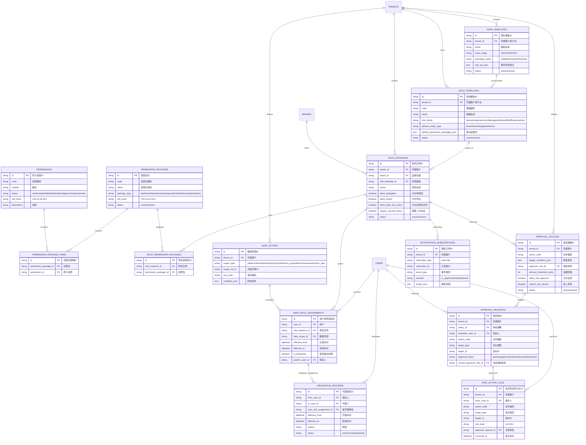
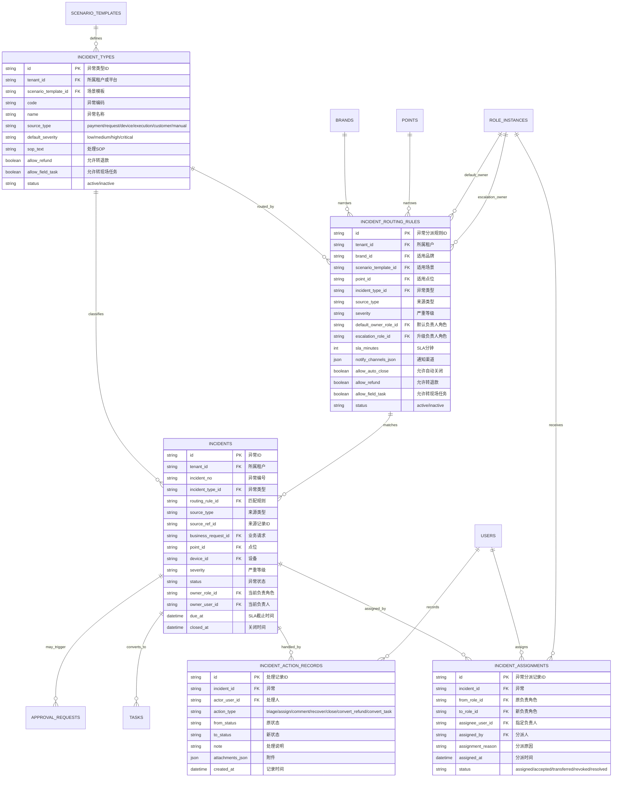

# RoboOps 核心数据模型 ERD

整理日期：2026-07-05
系统英文名：RoboOps
系统中文名：机器人商业运营平台

## 1. 建模目标

本文档用于把 MVP 阶段的核心业务对象、权限对象和异常分派对象落成一套可供后端建模参考的数据模型草案。

建模原则：

- 核心模型表达“机器人商业运营平台”，不表达“茶饮后台”。
- 饮品亭、咖啡亭只作为场景模板示例，糖度、温度、杯型、配方等字段只能出现在场景字段或样板数据中。
- MVP 先实现轻量状态机、异常中心、配置发布记录、角色权限和数据范围，不引入完整流程引擎、完整库存系统、完整客服工单系统。
- 所有关键业务实体保留 `tenant_id`、`brand_id`、`scenario_template_id` 或可推导的数据范围，方便后续多租户、多品牌和多场景扩展。
- 交易订单、服务单、任务请求在底层统一为 `business_requests`，界面可按场景显示为“订单”“服务请求”“任务单”等。

## 2. 命名与通用字段约定

### 2.1 表命名建议

- 表名使用英文复数、`snake_case`。
- 主键统一使用 `id`，建议采用 UUID/ULID；如团队已有自增 ID 规范，可保持一致。
- 外键以 `{entity}_id` 命名，例如 `tenant_id`、`brand_id`、`point_id`。
- 通用扩展字段使用 `metadata_json` 或更明确的 `{domain}_json`，但核心状态和关系字段不要藏在 JSON 中。
- 场景特有字段通过 `scenario_fields` 定义，通过属性表或 JSON 快照承载，避免进入核心表结构。

### 2.2 通用字段

| 字段 | 建议类型 | 说明 |
| --- | --- | --- |
| `id` | uuid/string | 主键 |
| `tenant_id` | uuid/string | 租户边界，平台级模板可为空或使用平台租户 |
| `brand_id` | uuid/string | 品牌边界，平台级模板或租户级对象可为空 |
| `status` | string | 启用、停用、归档等通用状态 |
| `created_at` | datetime | 创建时间 |
| `created_by` | uuid/string | 创建人 |
| `updated_at` | datetime | 更新时间 |
| `updated_by` | uuid/string | 更新人 |
| `deleted_at` | datetime | 软删除时间，MVP 可选 |
| `metadata_json` | json | 扩展信息，不能替代核心字段 |

## 3. MVP 核心运营 ERD

```mermaid
erDiagram
    TENANTS ||--o{ BRANDS : owns
    TENANTS ||--o{ ORGANIZATIONS : contains
    TENANTS ||--o{ USERS : has
    TENANTS ||--o{ SCENARIO_TEMPLATES : configures
    TENANTS ||--o{ DEVICE_TYPES : registers

    BRANDS ||--o{ POINTS : operates
    BRANDS ||--o{ PRODUCTS : sells
    ORGANIZATIONS ||--o{ POINTS : manages
    SCENARIO_TEMPLATES ||--o{ SCENARIO_FIELDS : defines
    SCENARIO_TEMPLATES ||--o{ POINTS : instantiated_by
    SCENARIO_TEMPLATES ||--o{ PRODUCT_TYPES : classifies
    SCENARIO_TEMPLATES ||--o{ FULFILLMENT_TEMPLATES : owns

    POINTS ||--o{ DEVICES : hosts
    DEVICE_TYPES ||--o{ DEVICES : typed_as
    DEVICES ||--o{ DEVICE_CAPABILITIES : exposes
    DEVICES ||--o{ DEVICE_EVENTS : emits

    PRODUCT_TYPES ||--o{ PRODUCTS : defines
    PRODUCTS ||--o{ PRODUCT_VARIANTS : has
    PRODUCTS ||--o{ PRODUCT_ATTRIBUTES : stores
    PRODUCT_VARIANTS ||--o{ PRODUCT_ATTRIBUTES : stores
    SCENARIO_FIELDS ||--o{ PRODUCT_ATTRIBUTES : constrains

    FULFILLMENT_TEMPLATES ||--o{ LIFECYCLE_STATES : contains
    FULFILLMENT_TEMPLATES ||--o{ STATE_TRANSITIONS : allows
    FULFILLMENT_TEMPLATES ||--o{ BUSINESS_REQUESTS : governs

    POINTS ||--o{ BUSINESS_REQUESTS : receives
    BUSINESS_REQUESTS ||--o{ REQUEST_ITEMS : includes
    PRODUCTS ||--o{ REQUEST_ITEMS : requested_as
    PRODUCT_VARIANTS ||--o{ REQUEST_ITEMS : selected_as

    BUSINESS_REQUESTS ||--o{ EXECUTION_EVENTS : records
    DEVICES ||--o{ EXECUTION_EVENTS : performs
    DEVICE_EVENTS ||--o{ INCIDENTS : may_create
    EXECUTION_EVENTS ||--o{ INCIDENTS : may_create
    BUSINESS_REQUESTS ||--o{ INCIDENTS : may_have
    POINTS ||--o{ INCIDENTS : may_have
    DEVICES ||--o{ INCIDENTS : may_have
    INCIDENTS ||--o{ TASKS : creates

    TENANTS ||--o{ CONFIG_RELEASES : publishes
    CONFIG_RELEASES ||--o{ CONFIG_RELEASE_TARGETS : targets
    USERS ||--o{ AUDIT_LOGS : acts

    TENANTS {
      string id PK "租户ID"
      string name "租户/客户名称"
      string tenant_type "platform/customer/operator"
      string status "active/suspended/archived"
    }

    BRANDS {
      string id PK "品牌ID"
      string tenant_id FK "所属租户"
      string name "品牌名称"
      string code "品牌编码"
      string default_scenario_template_id FK "默认场景模板"
      string status "draft/active/paused/archived"
      json theme_json "Logo/主题色等占位"
    }

    ORGANIZATIONS {
      string id PK "组织/区域ID"
      string tenant_id FK "所属租户"
      string parent_id FK "上级组织"
      string org_type "hq/region/city/team/partner"
      string name "组织名称"
      string city_code "城市编码"
      string status "active/inactive"
    }

    USERS {
      string id PK "用户ID"
      string tenant_id FK "所属租户"
      string org_id FK "默认组织"
      string name "姓名"
      string email "邮箱"
      string mobile "手机号"
      string status "invited/active/disabled"
    }

    SCENARIO_TEMPLATES {
      string id PK "场景模板ID"
      string tenant_id FK "所属租户或平台"
      string code "模板编码"
      string name "模板名称"
      string scenario_category "kiosk/service_station/retail/etc"
      json object_labels_json "界面命名"
      json enabled_modules_json "启用模块"
      string status "draft/active/archived"
    }

    SCENARIO_FIELDS {
      string id PK "字段ID"
      string scenario_template_id FK "所属场景模板"
      string field_key "字段键"
      string field_label "显示名称"
      string applies_to "product/variant/point/request/item/task"
      string value_type "text/number/enum/bool/datetime/json"
      json options_json "枚举/校验配置"
      boolean required "是否必填"
    }

    POINTS {
      string id PK "点位/场景单元ID"
      string tenant_id FK "所属租户"
      string brand_id FK "所属品牌"
      string org_id FK "所属组织/区域"
      string scenario_template_id FK "场景模板"
      string code "点位编码"
      string name "点位名称"
      string address "地址"
      string business_status "preparing/open/paused/closed/maintenance"
      string config_version "当前配置版本"
    }

    DEVICE_TYPES {
      string id PK "设备类型ID"
      string tenant_id FK "所属租户或平台"
      string code "类型编码"
      string name "类型名称"
      string vendor "厂商"
      json default_capabilities_json "默认能力"
    }

    DEVICES {
      string id PK "设备ID"
      string tenant_id FK "所属租户"
      string brand_id FK "所属品牌"
      string point_id FK "绑定点位"
      string device_type_id FK "设备类型"
      string sn "设备SN"
      string model "型号"
      string online_status "online/offline/unknown"
      string run_status "idle/busy/executing/warning/fault/maintenance/disabled"
      datetime last_heartbeat_at "最后心跳"
      string config_version "配置版本"
    }

    DEVICE_CAPABILITIES {
      string id PK "能力ID"
      string device_id FK "设备ID"
      string capability_code "能力编码"
      string capability_value "能力值"
      string status "active/inactive"
    }

    DEVICE_EVENTS {
      string id PK "设备事件ID"
      string tenant_id FK "所属租户"
      string device_id FK "设备ID"
      string event_type "heartbeat/status/error/command_result"
      string event_code "事件编码"
      string severity "info/warning/high/critical"
      json payload_json "原始事件"
      datetime occurred_at "发生时间"
    }

    PRODUCT_TYPES {
      string id PK "商品/服务类型ID"
      string tenant_id FK "所属租户或平台"
      string scenario_template_id FK "适用场景模板"
      string code "类型编码"
      string name "类型名称"
      string object_kind "physical_product/robot_service/rental/reservation"
      json schema_json "属性结构"
      string status "active/inactive"
    }

    PRODUCTS {
      string id PK "商品/服务ID"
      string tenant_id FK "所属租户"
      string brand_id FK "所属品牌"
      string product_type_id FK "商品/服务类型"
      string fulfillment_template_id FK "履约模板"
      string code "编码"
      string name "名称"
      string sale_status "draft/on_sale/off_sale/archived"
      int base_price_cents "基础价格"
      json attributes_json "通用属性快照"
    }

    PRODUCT_VARIANTS {
      string id PK "SKU/规格ID"
      string product_id FK "商品/服务ID"
      string sku_code "SKU编码"
      string name "规格名称"
      int price_cents "规格价格"
      json option_json "规格选项"
      string sale_status "on_sale/off_sale"
    }

    PRODUCT_ATTRIBUTES {
      string id PK "属性值ID"
      string product_id FK "商品/服务ID"
      string variant_id FK "SKU/规格ID"
      string field_id FK "场景字段"
      json value_json "属性值"
    }

    FULFILLMENT_TEMPLATES {
      string id PK "履约模板ID"
      string tenant_id FK "所属租户或平台"
      string scenario_template_id FK "所属场景模板"
      string code "模板编码"
      string name "模板名称"
      string version "版本"
      string status "draft/active/archived"
    }

    LIFECYCLE_STATES {
      string id PK "状态配置ID"
      string fulfillment_template_id FK "履约模板"
      string state_code "底层状态码"
      string display_name "场景显示名"
      int sort_order "排序"
      boolean is_terminal "是否终态"
    }

    STATE_TRANSITIONS {
      string id PK "状态流转ID"
      string fulfillment_template_id FK "履约模板"
      string from_state_code "起始状态"
      string to_state_code "目标状态"
      string trigger_type "manual/event/timeout/system"
      int timeout_minutes "超时分钟"
    }

    BUSINESS_REQUESTS {
      string id PK "业务请求ID"
      string tenant_id FK "所属租户"
      string brand_id FK "所属品牌"
      string point_id FK "发生点位"
      string scenario_template_id FK "场景模板"
      string fulfillment_template_id FK "履约模板"
      string request_no "业务单号"
      string request_type "order/service/reservation/task"
      string channel "来源渠道"
      string customer_ref "顾客外部引用"
      string payment_status "pending/paid/failed/cancelled"
      string lifecycle_status "统一生命周期状态"
      int total_amount_cents "总金额"
      string refund_status "none/pending/partial_refunded/refunded/rejected"
      datetime placed_at "创建/下单时间"
    }

    REQUEST_ITEMS {
      string id PK "请求明细ID"
      string business_request_id FK "业务请求"
      string product_id FK "商品/服务"
      string variant_id FK "SKU/规格"
      int quantity "数量"
      int unit_price_cents "成交单价"
      json option_snapshot_json "选项快照"
      json fulfillment_snapshot_json "履约配置快照"
    }

    EXECUTION_EVENTS {
      string id PK "执行事件ID"
      string tenant_id FK "所属租户"
      string business_request_id FK "业务请求"
      string device_id FK "设备"
      string point_id FK "点位"
      string event_type "dispatch/state_change/progress/result/error"
      string state_from "原状态"
      string state_to "新状态"
      string source_system "来源系统"
      json payload_json "事件载荷"
      datetime occurred_at "发生时间"
    }

    INCIDENTS {
      string id PK "异常ID"
      string tenant_id FK "所属租户"
      string incident_no "异常编号"
      string incident_type_id FK "异常类型"
      string source_type "payment/request/device/execution/manual"
      string source_ref_id "来源记录ID"
      string business_request_id FK "关联业务请求"
      string point_id FK "关联点位"
      string device_id FK "关联设备"
      string severity "low/medium/high/critical"
      string status "new/triaged/assigned/processing/closed"
    }

    TASKS {
      string id PK "任务/工单ID"
      string tenant_id FK "所属租户"
      string incident_id FK "关联异常"
      string point_id FK "关联点位"
      string device_id FK "关联设备"
      string task_type "field_service/manual_confirm/refund_followup/maintenance"
      string status "open/assigned/in_progress/resolved/closed/cancelled"
      datetime due_at "截止时间"
    }

    CONFIG_RELEASES {
      string id PK "配置发布ID"
      string tenant_id FK "所属租户"
      string release_type "scenario/product/point/device/lifecycle/incident_rule"
      string version "发布版本"
      string source_ref_type "来源对象类型"
      string source_ref_id "来源对象ID"
      string status "draft/pending_approval/publishing/applied/failed"
      string published_by FK "发布人"
      datetime published_at "发布时间"
    }

    CONFIG_RELEASE_TARGETS {
      string id PK "发布目标ID"
      string config_release_id FK "发布记录"
      string target_type "brand/org/point/device/device_group"
      string target_id "目标ID"
      string apply_status "pending/applied/failed/skipped"
      datetime applied_at "应用时间"
    }

    AUDIT_LOGS {
      string id PK "操作日志ID"
      string tenant_id FK "所属租户"
      string actor_user_id FK "操作人"
      string action_code "动作编码"
      string target_type "对象类型"
      string target_id "对象ID"
      string risk_level "L0/L1/L2/L3/L4"
      json payload_json "操作上下文"
      datetime occurred_at "发生时间"
    }
```

## 4. 核心实体字段草案

### 4.1 租户、品牌、组织与点位

| 实体 | 用途 | MVP 关键字段 |
| --- | --- | --- |
| `tenants` | 客户、平台方、运营主体边界 | `id`、`name`、`tenant_type`、`status`、`contact_name`、`contact_mobile` |
| `brands` | 对外经营品牌 | `tenant_id`、`name`、`code`、`default_scenario_template_id`、`logo_url`、`theme_json`、`status` |
| `organizations` | 总部、区域、城市、班组、合作方等管理层级 | `tenant_id`、`parent_id`、`org_type`、`name`、`city_code`、`status` |
| `users` | 登录用户与人员档案 | `tenant_id`、`org_id`、`name`、`email`、`mobile`、`status`、`last_login_at` |
| `points` | 真实部署的点位/场景单元 | `tenant_id`、`brand_id`、`org_id`、`scenario_template_id`、`code`、`name`、`address`、`longitude`、`latitude`、`business_hours_json`、`business_status`、`config_version` |

### 4.2 场景模板与动态字段

| 实体 | 用途 | MVP 关键字段 |
| --- | --- | --- |
| `scenario_templates` | 饮品亭、通用机器人服务站、无人零售站等模板 | `tenant_id`、`code`、`name`、`scenario_category`、`object_labels_json`、`enabled_modules_json`、`default_fulfillment_template_id`、`status` |
| `scenario_fields` | 定义某场景下的可配置字段 | `scenario_template_id`、`field_key`、`field_label`、`applies_to`、`value_type`、`options_json`、`required`、`sort_order` |
| `product_types` | 商品/服务类型 | `tenant_id`、`scenario_template_id`、`code`、`name`、`object_kind`、`schema_json`、`status` |
| `product_attributes` | 商品、服务或 SKU 的场景字段取值 | `product_id`、`variant_id`、`field_id`、`value_json` |

说明：

- 饮品的糖度、温度、杯型属于 `scenario_fields` 和 `product_attributes`。
- 通用机器人服务的服务时长、预约时间、执行地点也走同一套字段机制。
- MVP 可先用 `attributes_json` 快速实现，后续再按查询和校验需要拆细为属性表。

### 4.3 设备与事件

| 实体 | 用途 | MVP 关键字段 |
| --- | --- | --- |
| `device_types` | 人形机器人、机械臂、柜体、支付设备、屏幕、传感器等类型 | `tenant_id`、`code`、`name`、`vendor`、`default_capabilities_json`、`status` |
| `devices` | 机器人/设备台账 | `tenant_id`、`brand_id`、`point_id`、`device_type_id`、`sn`、`name`、`model`、`online_status`、`run_status`、`software_version`、`firmware_version`、`config_version`、`last_heartbeat_at` |
| `device_capabilities` | 设备能力标签 | `device_id`、`capability_code`、`capability_value`、`status` |
| `device_events` | 心跳、错误码、命令结果、运行状态事件 | `tenant_id`、`device_id`、`event_type`、`event_code`、`severity`、`payload_json`、`occurred_at` |

### 4.4 商品/服务目录

| 实体 | 用途 | MVP 关键字段 |
| --- | --- | --- |
| `products` | 可售商品或可调度服务 | `tenant_id`、`brand_id`、`product_type_id`、`fulfillment_template_id`、`code`、`name`、`description`、`image_url`、`sale_status`、`base_price_cents`、`attributes_json` |
| `product_variants` | SKU、规格或服务选项组合 | `product_id`、`sku_code`、`name`、`price_cents`、`option_json`、`sale_status` |
| `point_product_bindings` | 点位可售范围，ERD 中可作为扩展关联表 | `point_id`、`product_id`、`variant_id`、`sale_status`、`effective_from`、`effective_to` |

说明：

- `point_product_bindings` 在 MVP 很实用，用于表达某个点位是否销售某商品/服务。
- 如果第一版点位可售范围较简单，也可先在配置发布记录里保存范围快照，但正式模型建议保留独立关系表。

### 4.5 履约与业务请求

| 实体 | 用途 | MVP 关键字段 |
| --- | --- | --- |
| `fulfillment_templates` | 一类商品/服务的履约状态机模板 | `tenant_id`、`scenario_template_id`、`code`、`name`、`version`、`status` |
| `lifecycle_states` | 状态配置和场景显示名 | `fulfillment_template_id`、`state_code`、`display_name`、`sort_order`、`is_terminal` |
| `state_transitions` | 允许的状态流转和触发方式 | `fulfillment_template_id`、`from_state_code`、`to_state_code`、`trigger_type`、`timeout_minutes`、`incident_type_id` |
| `business_requests` | 底层统一的订单/服务请求/任务请求 | `tenant_id`、`brand_id`、`point_id`、`scenario_template_id`、`fulfillment_template_id`、`request_no`、`request_type`、`channel`、`customer_ref`、`payment_status`、`lifecycle_status`、`total_amount_cents`、`refund_status`、`placed_at` |
| `request_items` | 请求明细 | `business_request_id`、`product_id`、`variant_id`、`quantity`、`unit_price_cents`、`option_snapshot_json`、`fulfillment_snapshot_json` |
| `execution_events` | 下发、执行、进度、结果和状态变化事件 | `tenant_id`、`business_request_id`、`device_id`、`point_id`、`event_type`、`state_from`、`state_to`、`source_system`、`payload_json`、`occurred_at` |

## 5. 权限模型 ERD

权限模型采用“用户 + 角色实例 + 权限包 + 数据范围 + 审批策略 + 审计日志”的组合，覆盖单纯 RBAC 之外的数据范围、审批和审计要求。

## 6. 权限实体字段草案

| 实体 | 用途 | MVP 关键字段 |
| --- | --- | --- |
| `team_templates` | 最小运营团队、试点团队、城市复制团队等推荐模板 | `tenant_id`、`name`、`scale_stage`、`operating_mode`、`role_set_json`、`status` |
| `role_templates` | 平台内置或租户复制的角色模板 | `tenant_id`、`code`、`name`、`role_family`、`default_scope_type`、`default_permission_packages_json`、`risk_note`、`status` |
| `role_instances` | 客户实际使用的角色 | `tenant_id`、`brand_id`、`role_template_id`、`name`、`allow_delegation`、`allow_export`、`allow_high_risk_action`、`require_second_factor`、`status` |
| `permissions` | 原子动作权限 | `code`、`module`、`action`、`risk_level`、`description` |
| `permission_packages` | 可复用权限包 | `code`、`name`、`package_type`、`risk_level`、`status` |
| `permission_package_items` | 权限包明细 | `permission_package_id`、`permission_id` |
| `role_permission_packages` | 角色与权限包绑定 | `role_instance_id`、`permission_package_id` |
| `data_scopes` | 角色授权的数据边界 | `tenant_id`、`scope_type`、`scope_ref_id`、`city_code`、`condition_json` |
| `user_role_assignments` | 用户多角色授权 | `user_id`、`role_instance_id`、`data_scope_id`、`effective_from`、`effective_to`、`grantor_user_id`、`is_temporary` |
| `approval_policies` | 退款、停业、配置发布、设备高危命令等审批规则 | `tenant_id`、`action_code`、`trigger_condition_json`、`approver_role_id`、`amount_threshold_cents`、`allow_self_approval`、`require_two_person`、`status` |
| `approval_requests` | 审批实例 | `tenant_id`、`policy_id`、`requester_user_id`、`action_code`、`target_type`、`target_id`、`approval_status`、`current_approver_role_id` |
| `notification_subscriptions` | 用户或角色订阅通知 | `tenant_id`、`subscriber_type`、`subscriber_id`、`event_type`、`channel`、`scope_json` |
| `delegation_records` | 临时授权/代理记录 | `from_user_id`、`to_user_id`、`user_role_assignment_id`、`effective_from`、`effective_to`、`reason`、`status` |
| `risk_action_logs` | 高风险动作留痕 | `tenant_id`、`actor_user_id`、`action_code`、`target_type`、`target_id`、`risk_level`、`approval_request_id`、`occurred_at` |

MVP 内置角色模板建议：

- 平台支持。
- 租户管理员。
- 业务负责人。
- 运营负责人。
- 点位负责人。
- 商品/配置管理员。
- 配置发布人。
- 客服/售后。
- 退款审批人。
- 机器人/设备运维。
- 现场维护员。
- 财务/结算。
- 数据查看员。
- 审计员。
- 演示操作员。

## 7. 异常分派模型 ERD

异常中心需要支持“异常生成、分诊、分派、处理、升级、关闭、转退款、转现场任务”的闭环。

## 8. 异常分派实体字段草案

| 实体 | 用途 | MVP 关键字段 |
| --- | --- | --- |
| `incident_types` | 异常字典，可由场景模板提供默认值 | `tenant_id`、`scenario_template_id`、`code`、`name`、`source_type`、`default_severity`、`sop_text`、`allow_refund`、`allow_field_task`、`status` |
| `incident_routing_rules` | 异常匹配和默认分派规则 | `tenant_id`、`brand_id`、`scenario_template_id`、`point_id`、`incident_type_id`、`source_type`、`severity`、`default_owner_role_id`、`escalation_role_id`、`sla_minutes`、`notify_channels_json`、`allow_auto_close`、`allow_refund`、`allow_field_task`、`status` |
| `incidents` | 真实异常实例 | `tenant_id`、`incident_no`、`incident_type_id`、`routing_rule_id`、`source_type`、`source_ref_id`、`business_request_id`、`point_id`、`device_id`、`severity`、`status`、`owner_role_id`、`owner_user_id`、`due_at`、`closed_at` |
| `incident_assignments` | 分派、转派、升级历史 | `incident_id`、`from_role_id`、`to_role_id`、`assignee_user_id`、`assigned_by`、`assignment_reason`、`assigned_at`、`status` |
| `incident_action_records` | 异常处理记录 | `incident_id`、`actor_user_id`、`action_type`、`from_status`、`to_status`、`note`、`attachments_json`、`created_at` |
| `tasks` | 由异常或运营动作生成的轻量任务/工单 | `tenant_id`、`incident_id`、`point_id`、`device_id`、`task_type`、`status`、`owner_role_id`、`assignee_user_id`、`due_at`、`completed_at` |

默认异常类型建议从通用来源建模：

| 来源 | 示例异常类型 | 默认责任建议 |
| --- | --- | --- |
| 支付 | 支付失败、已支付但未同步 | 客服/售后，升级运营负责人 |
| 请求下发 | 已支付但未下发、下发超时 | 运营调度，升级设备运维 |
| 机器人/设备执行 | 接单失败、执行超时、执行失败 | 机器人/设备运维，升级运营负责人 |
| 交付确认 | 未交付/未取走、交付判断不确定 | 客服/售后或运营调度，升级点位负责人 |
| 资源/耗材 | 物料不足、耗材不足、清洁维护到期 | 现场维护员，升级运营负责人 |
| 点位环境 | 断电、场地封闭、人流管控 | 点位负责人，升级运营负责人 |
| 配置 | 配置错误、价格或可售范围异常 | 商品/配置管理员，升级配置审批人 |
| 安全 | 设备安全风险、交互安全风险 | 运营负责人，升级业务负责人 |

## 9. 状态枚举

### 9.1 业务请求生命周期状态

底层状态统一，显示名按场景模板配置。

| 状态码 | 默认中文 | 说明 |
| --- | --- | --- |
| `created` | 已创建 | 请求已创建，可能尚未进入支付或履约 |
| `pending_payment` | 待支付 | 等待支付 |
| `paid` | 已支付 | 支付完成，等待履约准备 |
| `ready_to_execute` | 待执行 | 满足执行条件，等待下发或派单 |
| `assigned` | 已分配 | 已分配给设备、机器人或执行单元 |
| `executing` | 执行中 | 正在制作、配送、讲解、服务等 |
| `execution_completed` | 执行完成 | 设备或服务动作完成 |
| `awaiting_delivery` | 待交付 | 等待顾客取走、确认或交付完成 |
| `delivered` | 已交付 | 已取走、已确认或服务完成 |
| `not_delivered` | 未交付 | 超时未取走、未确认或交付失败 |
| `exception` | 异常 | 进入异常处理 |
| `cancelled` | 已取消 | 请求取消 |
| `refund_pending` | 退款处理中 | 已发起退款或补偿处理 |
| `refunded` | 已退款 | 退款完成 |

### 9.2 异常状态

| 状态码 | 默认中文 | 说明 |
| --- | --- | --- |
| `new` | 新异常 | 尚未分诊 |
| `triaged` | 已分诊 | 已确认类型、等级和处理方向 |
| `assigned` | 已分派 | 已分派负责人或角色 |
| `processing` | 处理中 | 正在处理 |
| `waiting_manual_confirm` | 等待人工确认 | 需要人工判断、现场确认或顾客确认 |
| `recovered` | 已恢复 | 业务或设备已恢复，但可继续观察 |
| `closed` | 已关闭 | 异常闭环完成 |
| `converted_to_refund` | 已转退款 | 转入退款处理 |
| `converted_to_field_service` | 已转现场处理 | 转成现场任务/工单 |

### 9.3 任务/工单状态

| 状态码 | 默认中文 | 说明 |
| --- | --- | --- |
| `open` | 已创建 | 任务已创建 |
| `assigned` | 已分派 | 已分派负责人 |
| `in_progress` | 处理中 | 正在处理 |
| `waiting_external` | 等待外部条件 | 等待顾客、供应商、现场条件等 |
| `resolved` | 已解决 | 已完成处理，待关闭或复核 |
| `closed` | 已关闭 | 任务关闭 |
| `cancelled` | 已取消 | 任务取消 |

### 9.4 设备状态

| 枚举 | 值 | 说明 |
| --- | --- | --- |
| `online_status` | `online`、`offline`、`unknown` | 连接状态 |
| `run_status` | `idle`、`busy`、`executing`、`warning`、`fault`、`maintenance`、`disabled` | 业务运行状态 |
| `command_status` | `created`、`sent`、`acknowledged`、`succeeded`、`failed`、`timeout`、`cancelled` | 远程命令记录状态，MVP 可先预留 |

### 9.5 配置发布状态

| 状态码 | 默认中文 | 说明 |
| --- | --- | --- |
| `draft` | 草稿 | 尚未提交发布 |
| `pending_approval` | 待审批 | 命中审批策略 |
| `approved` | 已审批 | 可执行发布 |
| `publishing` | 发布中 | 正在应用到目标范围 |
| `partially_applied` | 部分生效 | 部分目标成功 |
| `applied` | 已生效 | 发布完成 |
| `failed` | 发布失败 | 发布失败，需要处理 |
| `rolled_back` | 已回滚 | 已回退到旧版本 |
| `cancelled` | 已取消 | 发布取消 |

### 9.6 权限与审批状态

| 枚举 | 值 | 说明 |
| --- | --- | --- |
| `permission_risk_level` | `L0`、`L1`、`L2`、`L3`、`L4` | L0 只读，L1 普通编辑，L2 业务影响，L3 高风险操作，L4 敏感管理 |
| `approval_status` | `pending`、`approved`、`rejected`、`cancelled`、`expired` | 审批实例状态 |
| `role_status` | `active`、`inactive`、`archived` | 角色状态 |
| `assignment_status` | `active`、`expired`、`revoked` | 用户授权状态 |

## 10. 场景模板示例：饮品亭

以下内容只是模板示例，不应进入核心模型硬编码。

### 10.1 场景模板

| 字段 | 示例值 |
| --- | --- |
| `scenario_templates.code` | `beverage_kiosk` |
| `scenario_templates.name` | 饮品亭 |
| `object_labels_json.request` | 订单 |
| `object_labels_json.product` | 饮品 |
| `object_labels_json.delivery` | 取杯 |
| `enabled_modules_json` | 商品、SKU、取货、设备事件、异常、任务、配置发布 |

### 10.2 场景字段

| `field_key` | `field_label` | `applies_to` | `value_type` | 示例 |
| --- | --- | --- | --- | --- |
| `cup_size` | 杯型 | `variant` | `enum` | 中杯、大杯 |
| `temperature` | 温度 | `item` | `enum` | 热、冰、常温 |
| `sugar_level` | 糖度 | `item` | `enum` | 无糖、半糖、全糖 |
| `recipe_code` | 配方编码 | `product` | `text` | 外部制饮设备配方号 |
| `pickup_timeout_minutes` | 取杯超时分钟 | `point` | `number` | 10 |

### 10.3 状态显示名映射

| 底层状态 | 饮品亭显示名 |
| --- | --- |
| `ready_to_execute` | 待制作 |
| `assigned` | 已下发设备 |
| `executing` | 制作中 |
| `execution_completed` | 出杯完成 |
| `awaiting_delivery` | 待取杯 |
| `delivered` | 已取杯 |
| `not_delivered` | 未取杯 |
| `exception` | 制作异常 |

### 10.4 异常类型示例

| 异常编码 | 名称 | 来源 | 默认负责人 |
| --- | --- | --- | --- |
| `beverage_material_low` | 物料不足 | 资源/耗材 | 现场维护员 |
| `beverage_dispatch_failed` | 订单下发失败 | 请求下发 | 运营调度 |
| `beverage_making_timeout` | 制作超时 | 设备执行 | 机器人/设备运维 |
| `beverage_pickup_uncertain` | 取杯判断不确定 | 交付确认 | 运营调度 |
| `beverage_not_picked_up` | 顾客未取杯 | 交付确认 | 客服/售后 |

## 11. 场景模板示例：通用机器人服务站

| 字段 | 示例值 |
| --- | --- |
| `scenario_templates.code` | `robot_service_station` |
| `scenario_templates.name` | 通用机器人服务站 |
| `object_labels_json.request` | 服务请求 |
| `object_labels_json.product` | 服务项目 |
| `object_labels_json.delivery` | 服务确认 |

示例字段：

| `field_key` | `field_label` | `applies_to` | `value_type` | 示例 |
| --- | --- | --- | --- | --- |
| `service_duration_minutes` | 服务时长 | `variant` | `number` | 15 |
| `service_location` | 执行地点 | `request` | `text` | 展厅 A 区 |
| `reservation_time` | 预约时间 | `request` | `datetime` | 2026-07-05 14:00 |
| `human_confirmation_required` | 是否需要人工确认 | `product` | `bool` | true |

状态显示名示例：

| 底层状态 | 服务站显示名 |
| --- | --- |
| `ready_to_execute` | 待派单 |
| `assigned` | 已派发机器人 |
| `executing` | 服务中 |
| `execution_completed` | 服务完成 |
| `awaiting_delivery` | 待确认 |
| `delivered` | 已确认 |
| `not_delivered` | 未确认 |
| `exception` | 服务异常 |

## 12. MVP 建表优先级建议

### 12.1 P0：必须先建

- `tenants`
- `brands`
- `organizations`
- `users`
- `scenario_templates`
- `scenario_fields`
- `points`
- `device_types`
- `devices`
- `device_events`
- `product_types`
- `products`
- `product_variants`
- `fulfillment_templates`
- `lifecycle_states`
- `state_transitions`
- `business_requests`
- `request_items`
- `execution_events`
- `incident_types`
- `incident_routing_rules`
- `incidents`
- `incident_action_records`
- `tasks`
- `role_templates`
- `role_instances`
- `permissions`
- `permission_packages`
- `data_scopes`
- `user_role_assignments`
- `approval_policies`
- `audit_logs`

### 12.2 P1：MVP 可随功能细化补齐

- `product_attributes`
- `point_product_bindings`
- `device_capabilities`
- `config_releases`
- `config_release_targets`
- `permission_package_items`
- `role_permission_packages`
- `approval_requests`
- `notification_subscriptions`
- `incident_assignments`
- `risk_action_logs`
- `delegation_records`
- `report_snapshots`

### 12.3 明确后置

- 完整库存、仓储、采购、补货表。
- 完整财务结算、分账、对账表。
- 完整 OTA、远程调试和复杂设备作业表。
- 复杂 BPMN/Temporal 工作流实例表。
- 会员、营销、优惠券、CRM 表。
- 字段级权限、复杂数据脱敏和外部 IAM 深度集成。

## 13. 关键索引建议

| 表 | 建议索引 |
| --- | --- |
| `brands` | `(tenant_id, status)`、`(tenant_id, code)` |
| `organizations` | `(tenant_id, parent_id)`、`(tenant_id, org_type)` |
| `points` | `(tenant_id, brand_id, org_id)`、`(tenant_id, scenario_template_id, business_status)` |
| `devices` | `(tenant_id, point_id)`、`(tenant_id, sn)`、`(tenant_id, online_status, run_status)` |
| `device_events` | `(tenant_id, device_id, occurred_at)`、`(tenant_id, event_type, event_code)` |
| `products` | `(tenant_id, brand_id, sale_status)`、`(tenant_id, product_type_id)` |
| `business_requests` | `(tenant_id, brand_id, point_id, placed_at)`、`(tenant_id, request_no)`、`(tenant_id, lifecycle_status)` |
| `execution_events` | `(tenant_id, business_request_id, occurred_at)`、`(tenant_id, device_id, occurred_at)` |
| `incidents` | `(tenant_id, status, severity)`、`(tenant_id, point_id, status)`、`(tenant_id, owner_role_id, status)` |
| `tasks` | `(tenant_id, status, due_at)`、`(tenant_id, assignee_user_id, status)` |
| `user_role_assignments` | `(user_id, role_instance_id)`、`(role_instance_id, data_scope_id)` |
| `audit_logs` | `(tenant_id, actor_user_id, occurred_at)`、`(tenant_id, target_type, target_id)` |

## 14. 数据边界与审计要求

- 租户隔离优先：业务查询默认必须带 `tenant_id`。
- 品牌、组织、点位、设备、场景模板都可以成为数据范围。
- 平台支持人员跨租户访问必须写入 `audit_logs`，高风险动作写入 `risk_action_logs`。
- 退款、停业、恢复营业、配置发布、设备高危命令、权限分配、财务导出都应绑定 `permission_risk_level` 和审批策略。
- 异常关闭、转退款、转现场任务必须有 `incident_action_records`。
- 配置发布需要记录发布对象、发布范围、版本、发布人、发布时间和目标应用结果。
- 若后续真实业务需要客服录音、现场照片或设备排障附件，应作为订单、异常、任务或设备记录的附件能力设计，并由对应对象权限和审计日志控制；项目访谈和需求材料不进入产品数据模型。

## 15. 与后续 PRD/后端设计的衔接

- PRD 页面可使用中文业务名，但后端核心对象建议保持本文的通用命名。
- 如果工程团队希望保留 `orders` 作为接口名称，也建议在底层或领域层映射到 `business_requests`，避免后续非交易服务场景重构。
- 场景模板、状态显示名、异常字典和角色模板应支持平台内置默认值，再由租户复制和调整。
- Demo 数据可以先创建一个饮品亭模板和一个通用机器人服务站模板，用同一套 `business_requests`、`fulfillment_templates`、`incidents` 验证通用性。
